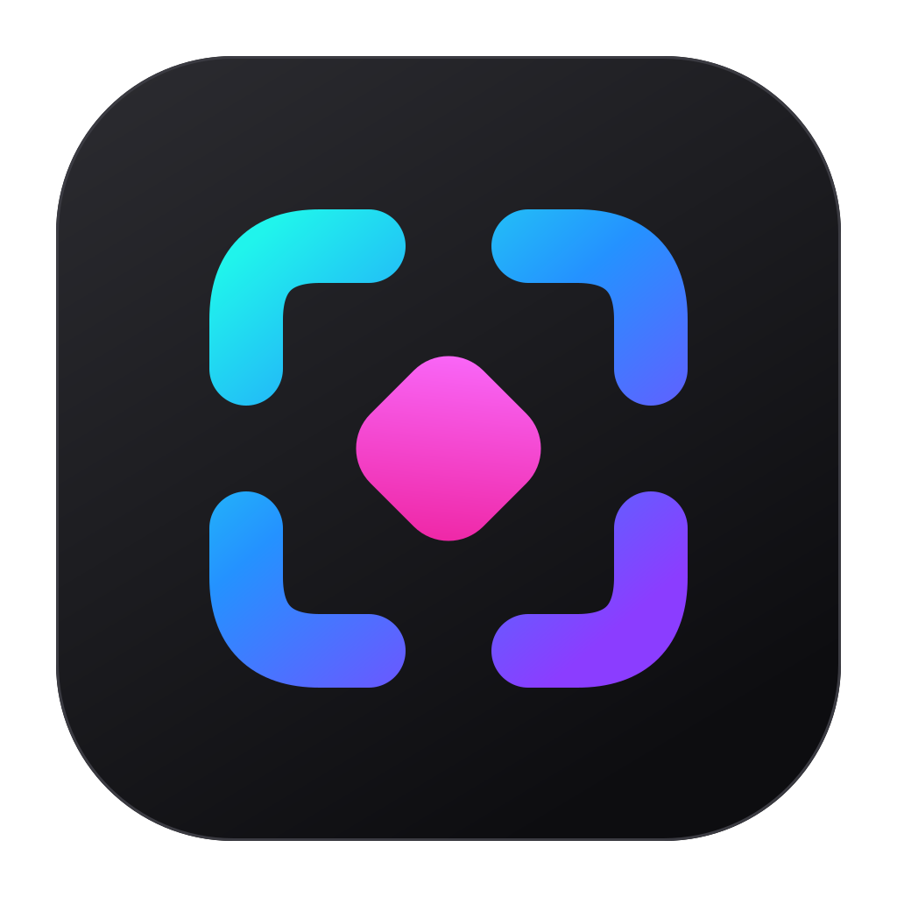

<p align="center"></p>

<h1 align="center">Snapmark</h1>

<p align="center">Screenshot, mark it up, and collect it in one Markdown file you can hand to an AI.</p>

---

## What it is for

When you review a UI with an AI agent (Claude Code, Cursor, Codex), you spend a lot of words describing _where_ something is: "the second button in the header, the one next to…". A picture with a numbered marker says it faster and more precisely.

Snapmark is a macOS menu bar app for exactly that loop:

1. Press `⌘⇧1`, drag over the part of the screen you mean.
2. Mark it: a box, an arrow, a cross for "remove this", a green tick for "keep this", numbered markers ① ② with a note each.
3. Press `⌘↵`. The annotated image and your notes are appended to the current session's `session.md`.
4. Point your agent at the session folder: _"Work through `~/Documents/Snapmark/2026-09-25 14.02/session.md`"_.

### Why it is token-efficient

- **Crops, not full screens.** You capture only the region that matters. Models shrink large images (Claude to about 1.15 megapixels), so on a full-screen capture small UI text becomes unreadable; on a crop it stays sharp, and the model does not spend attention on the rest of the screen.
- **Saved at the size the model uses.** Retina captures are 2× pixels. Snapmark stores every image within 1568 px on the long edge and about 1.15 megapixels, the limits above which Claude resizes anyway. Nothing is lost for the model, and uploads and sessions stay small.
- **Numbers instead of descriptions.** Note 2 refers to marker ② on the image. The model does not have to guess which element you mean, and you do not have to describe it.
- **One plain Markdown file per session.** No app, no account, no export step. Any agent that reads files can read it, and it diffs cleanly in git.

A session looks like this:

```markdown
# 2026-09-25 14.02

## 001 · 14:03


Checkout page on mobile width.

1. Button label is cut off, should wrap
2. Remove this promo banner entirely
```

## Install

1. Download the DMG for your Mac from [Releases](https://github.com/cdudek/snapmark/releases/latest): `arm64` for Apple Silicon (M1 and later), `x64` for Intel.
2. Open it and drag **Snapmark** onto **Applications**.
3. First launch: the app is not yet signed with an Apple Developer ID, so macOS blocks it. Open **System Settings → Privacy & Security** and click **Open Anyway** under the Snapmark message.
4. On the first capture macOS asks for **Screen Recording** permission. Grant it, then quit Snapmark from the menu bar and start it again. Without it, captures show only the wallpaper.

Snapmark has no Dock icon. It lives in the menu bar as the corner-and-dot icon.

## Use

| Shortcut | Anywhere                                  |
| -------- | ----------------------------------------- |
| `⌘⇧1`    | Capture a region into the current session |
| `⌘⇧2`    | Start a new session                       |

In the editor, press a number to pick a tool. Press the same number again to cycle its shapes; the top bar shows which one is active.

| Key   | Tool                                       | Press again for                     |
| ----- | ------------------------------------------ | ----------------------------------- |
| `1`   | Box                                        | Ellipse                             |
| `2`   | Arrow                                      | Pen (freehand)                      |
| `3`   | Cross (always red)                         | Crossed box → Remove area (hatched) |
| `4`   | Tick (always green)                        | Thumbs up                           |
| `5`   | Numbered marker: click, then type its note | —                                   |
| `⌘Z`  | Undo                                       |                                     |
| `⌘↵`  | Add to session                             |                                     |
| `Esc` | Discard                                    |                                     |

The menu bar menu switches sessions, opens `session.md`, shows the session folder and checks for updates.

**Export session → ZIP** packs `session.md` and `img/` into `<session>.zip`, for agents and developers. **Export session → PDF** renders the session into `<session>.pdf`, for people who just want to read it. Both land in the session folder, and Finder opens with the file selected. Sessions are stored in `~/Documents/Snapmark/`. **Change sessions folder…** moves new sessions elsewhere; pick a folder inside iCloud Drive or Google Drive and your sessions sync and can be shared from there. The `SNAPMARK_ROOT` environment variable overrides the choice (used by the tests).

## Develop

Requires Node 22 and macOS.

```sh
npm install
npm start            # build and run from source
npm run format       # prettier
npm run lint         # eslint
npm run typecheck    # tsc --noEmit
npm test             # session and Markdown logic
npm run smoke        # drives the real editor window: draws every tool, saves, checks pixels and Markdown
npm run dist         # build DMG + ZIP into release/ (ad-hoc signed)
```

| Path                  | What                                                  |
| --------------------- | ----------------------------------------------------- |
| `src/main.ts`         | Menu bar, global shortcuts, capture, auto-update, IPC |
| `src/editor.ts/.html` | Annotation editor window                              |
| `src/sessions.ts`     | Session folders and `session.md` writing              |
| `assets/`             | App icon, menu bar template icon                      |
| `build/`              | Packaging resources (icon, entitlements)              |

CI (`.github/workflows/ci.yml`) runs format check, lint, typecheck, unit test and the smoke test on every pull request.

## Release

Versions follow [semver](https://semver.org). A release is a pull request that bumps the version:

```sh
git fetch origin && git checkout -b release/next origin/main
npm version minor --no-git-tag-version     # or patch / major
git commit -am "chore: release v$(node -p "require('./package.json').version")"
gh pr create --fill
```

When it merges, `.github/workflows/release.yml` sees a version without a release, builds `arm64` and `x64` DMGs and ZIPs on macOS, and publishes the GitHub release and its `vX.Y.Z` tag with generated notes. Merges that do not change the version skip the macOS build.

`main` requires the `check` job from CI to pass, so nothing merges untested.

### Auto-update

The app checks GitHub Releases on start and from **Check for updates…** in the menu, downloads in the background, and installs on quit (`electron-updater`). Two conditions must hold for it to work:

1. **The app must be signed with a Developer ID.** macOS refuses to apply updates to ad-hoc signed apps. Add these repository secrets and the release workflow signs and notarizes automatically: `MAC_CERT_P12_BASE64`, `MAC_CERT_PASSWORD`, `APPLE_ID`, `APPLE_APP_SPECIFIC_PASSWORD`, `APPLE_TEAM_ID`.
2. **The app must be able to read the releases.** Releases of a private repository return 404 without a token, so updates only work once releases are public.
