# Snapmark interaction guidelines: editing, navigation, dialogs, and feedback

The shared rules for how the whole app behaves. Only the owner accepts a rule; nothing here is accepted yet.

Drafted on 2026-09-25 from the audit of v0.2.0 (190 findings). Every rule below is **proposed**. Where
a rule changes something the owner asked for, the rule says so and names the alternative. Screenshots
are from the audit and show the app as it is today; anything marked **Proposal** does not exist yet.

The three scenes every rule and flow is written for (confirmed by the owner, 2026-09-25):

- **Reviewing an overnight build.** A complete review of what an agent built overnight, many
  screenshots in a row, captured on the fly with shortcuts, then handed to Claude Code. The main scene.
- **Sharing with a person.** The same session as a PDF or ZIP for a teammate.
- **A quick verdict.** One screenshot: red for what goes, green for what stays.

## Principles

Every rule traces back to one or more of these.

1. **Never lose the reviewer's work.** Every way out of a screenshot with marks on it is safe, and a
   failure keeps the work on screen with a way forward.
2. **Undo first; ask only when something cannot be undone.** A small mistake is fixed with ⌘Z, not
   prevented with a question; a question appears only where work would be gone for good.
3. **One key, one word, one meaning.** A key, a colour or a word does the same thing every time and
   everywhere: red always means remove, "5" always gives the same tool, "note" always names the same text.
4. **Everything on the fly, from the keyboard.** Every action has a key, keys act where the reviewer is
   looking, and nothing needs the pointer except freehand drawing.
5. **The text says what the image shows.** What a mark means is written in words, in the editor, in
   session.md and in the PDF, so an agent, a teammate or a screen reader never has to decode pixels.
6. **Feedback in proportion, never only in a vanishing message.** Every change that leaves the editor
   window is confirmed once, briefly, naming the object; a failure stays visible where it happened and
   says what to do next.
7. **Stay in the review.** The reviewer can see where the screenshot goes and reach the session from
   wherever they are, without leaving the editor for the menu bar or Finder.

## Rules

### Editing

#### Edit a mark where it is

- **Status:** proposed
- **Situation:** drawing a mark, then adjusting it: moving, resizing, recolouring or rewording it.
- **Owner's words:** "Help me think about how we can highlight stuff and potentially add UI elements, like being able to add a card and write on the card, so I can actually edit on the screen and drag and drop, size, and so on." — 2026-09-25
- **Rule:** every mark is made with one gesture (a drag, a click for a default size, or two clicks
  for tools that need a start and an end) and adjusted where it sits:
  - Double-click on a card edits its text, whatever tool is active. Enter on a selected card does the same.
  - Holding ⌘ with any drawing tool picks up and moves a mark, as Select does, without leaving the tool.
  - With a mark selected, the colour control recolours it, as one undoable step. The next mark uses the new colour too.
  - The arrow keys move the selected mark by one screen pixel, Shift+arrow by ten.
  - Selection handles are the same size on screen at any capture size: about 10 px visible, with a
    24 × 24 px area that catches the pointer, a solid edge and a white fill. The selected mark has a
    clear outline.
  - Esc during a drag cancels it and adds nothing.
  - Cut & move stays active after a cut: pressing inside a lifted piece moves it, pressing outside starts the next cut.
  - A card keeps inside the image as it grows, by growing wider before it grows past the bottom edge.
  - Card and marker sizes follow the text size on the reviewer's screen, not the capture's pixel count.
- **Why it helps:** fixing a mark costs one gesture instead of "V, click, fix, then press the tool
  again", and nothing lands outside the saved image.
- **Tradeoff:** a double-click can no longer draw a default-size mark on top of a card; larger handles
  overlap very small marks (the middle handles hide on those).
- **Exceptions:**
  - Redactions cannot be moved or resized, because moving one would uncover what it hides. Screens: editor canvas.
  - Markers have a fixed size and no handles, so a session looks even. Screens: editor canvas.
  - Freehand pen strokes are pointer-only (see "Every pointer action has a keyboard route").
- **Example:** today the handles are 4.5 px wide on a Retina screen at the smallest window
  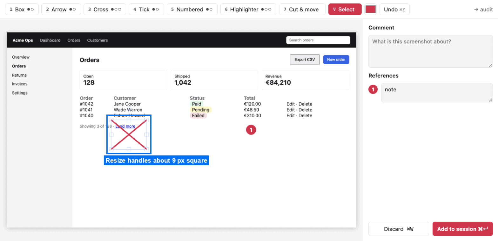
  and a card near the bottom runs off the image
  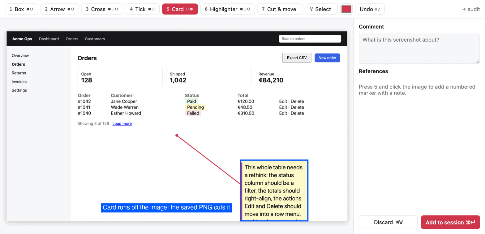.
  **Proposal:** Box is active, the reviewer double-clicks the card "Load more should be a button" and
  fixes a typo without pressing V; then selects the box around the header and presses → three times to
  tighten it.
- **Applies to:** editor canvas, toolbar colour control.

Supporting notes

- Resolves: F010 (emptied card), F017 (handles), F028 (recolour), F041 (long card), F050 (double-click from any tool), F051 (mark size), F053 (Enter edits card), F063 (nudge), F080 (marker covers target: see the "Markers sit beside the point" option in F080, left to decision), F086 (Esc cancels drag), F100 (card covers target), F101 (temporary Select), F103 (Cut & move switches tool), F110 (marker size), F111 (stroke weights: design choice, left to decision).
- Accessibility rule 11 from the accessibility review (targets at least 24 × 24 screen pixels, canvas handles included) lives here.
- Today: drawing tools skip existing objects (`src/editor.ts:318`), so only Select edits; `cornerSize` is Fabric's default 13 canvas px, shrunk by CSS scaling (`:633-639`); the colour input only affects the next mark (`:627`); Cut & move switches to Select (`:427-429`); cards are 70 units wide and grow down (`:252-270`); `unit = max(2, round(longEdge/400))` (`:647`).
- Other products: macOS Screenshot markup, Figma and Xnapper recolour the selection and nudge with arrows; Figma holds ⌘ for direct select.

#### Red means remove, green means approve, and nothing else

- **Status:** proposed
- **Situation:** any mark, button or badge that uses colour.
- **Owner's words:** "Also again, we need more elements to be clear about what should go away and what should not. Maybe: … a tick for approving, or kind of like a thumbs up or something for approval in green" — 2026-09-25
- **Rule:**
  - Red is used only by the Remove group (cross, crossed box, hatched area); green only by the Approve group (tick, thumbs up).
  - Boxes, ellipses, arrows, pen strokes, markers, cards and card pointers start in a colour no
    fixed-meaning group uses (for example blue), and the colour control offers a short palette without
    the remove red and the approve green.
  - Cut & move draws its dashed outline and arrow in its own fixed colour.
  - While a fixed-colour group is active, the colour control shows that group's colour, is disabled, and
    its tooltip says why ("Remove marks are always red").
  - The app's own accent (the pressed tool, "Add to session", marker badges) is not the remove red.
  - Remove and approve always differ by shape as well as colour.
  - Every line mark has a thin halo so it reads on any background; a marker's number is black or white
    depending on how light its fill is; a highlight always shows its edge, so it reads on dark interfaces.
- **Why it helps:** in the quick verdict and for the agent reading the image, a red box that means
  "look here" can no longer be mistaken for a red cross that means "remove".
- **Tradeoff:** red is the classic annotation colour and some reviewers will miss it; existing sessions
  stay red; one more fixed colour (moves) to learn.
- **Exceptions:** none. The Highlight group's yellow is fixed too, and yellow has no verdict meaning.
- **Example:** today a red box ("look here"), a red cross ("remove") and a red marker share one colour
  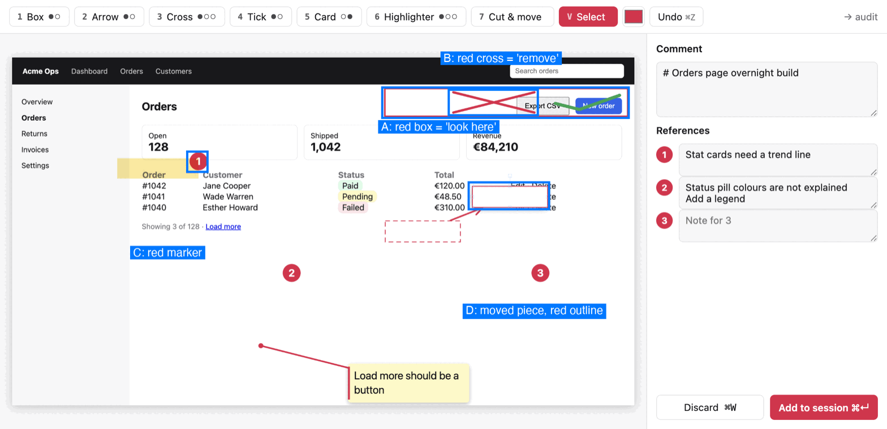
  and a green box looks like an approval
  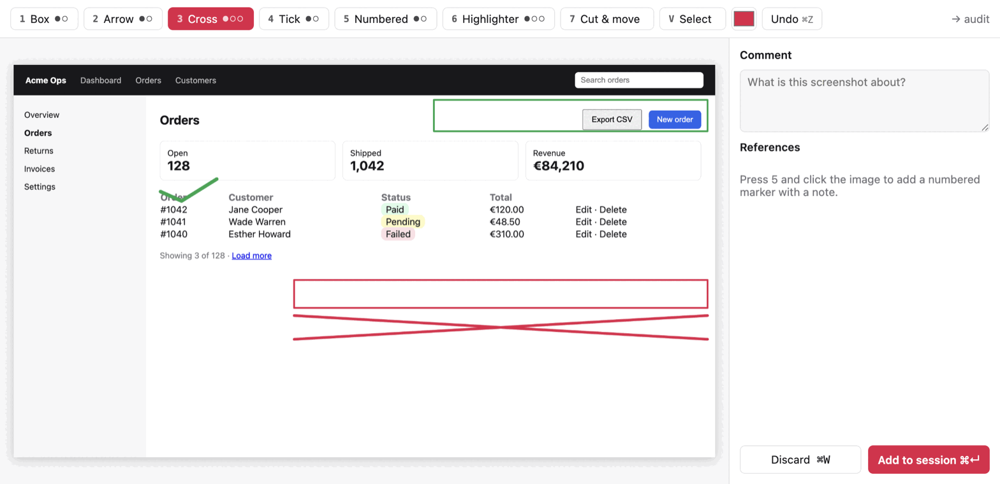.
  **Proposal:** the same screenshot with a blue box, a red cross and a blue marker; the colour control
  greyed out in red while "3 Remove" is active.
- **Applies to:** editor toolbar, colour control, canvas, saved images, side-panel badges, PDF.

Supporting notes

- Resolves: F012, F027, F035, F056, F057, F075, F077, F107; related F054, F055 (pressed-button contrast, see "Fields, buttons and pressed tools can be read").
- Accessibility rules 6 (remove and approve differ by shape; red and green reserved) and 7 (halos; black or white text from the fill) from the accessibility review live here.
- Project hard rule: "Remove marks are always red and approve marks always green". Today it holds literally but red is not exclusive: the colour input starts at `#e11d48` (`src/editor.html:183`), the same value as `RED` (`src/editor.ts:9`) and `--accent`; the prompt says "Red crosses and hatched areas mean remove" (`src/main.ts:131`).
- Today the swatch stays live for groups 3, 4 and 6 and is ignored (`src/editor.ts:97`); Cut & move uses the free colour (`:396`).
- Other products: macOS markup defaults to red with no meaning; Figma and Xnapper use a neutral accent for pointers and selection.

#### Hiding and dimming sit under the marks, and nothing brings back hidden pixels

- **Status:** proposed
- **Situation:** Redact, Spotlight and Cut & move on the same screenshot as other marks.
- **Rule:** the screenshot is always the bottom layer; redactions and spotlight dimming sit directly
  above it; every other mark sits above those. All spotlights share one dimming layer with several
  openings. A cut piece is taken from the screenshot as it looks with its redactions, so a redacted area
  stays pixelated wherever it is moved. Redaction makes text unreadable at any size.
- **Why it helps:** a customer name hidden before sharing can never reappear in the PDF sent to a
  teammate; marks drawn earlier are never hidden or dimmed by a later redaction or spotlight.
- **Tradeoff:** a redaction becomes part of anything cut from that area, so undoing the redaction later
  does not un-pixelate a piece already cut.
- **Exceptions:** none.
- **Example:** today a redaction drawn after marker 2 hides it, while the text still lists "2. _(no note)_"
  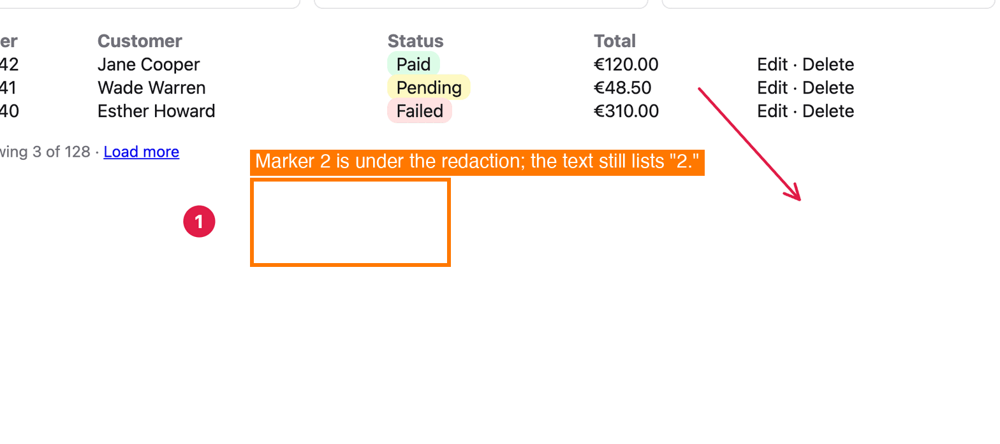,
  and two spotlights cancel each other
  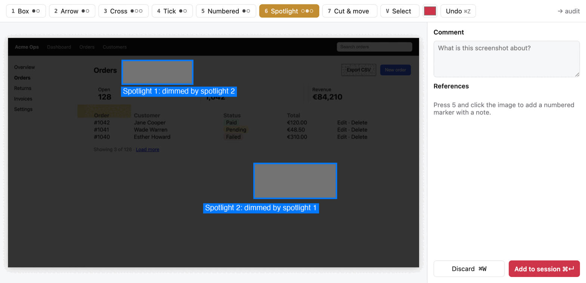.
  **Proposal:** redact a name, cut the row across it, drag the row away: the moved row stays pixelated.
- **Applies to:** editor canvas, saved image, PDF, ZIP.

Supporting notes

- Resolves: F005 (critical: cut shows redacted pixels), F032, F033, F034, F104.
- Today: redact and cut both build from the untouched `background.getElement()` (`src/editor.ts:357-375`, `:408-417`); `canvas.add` appends on top with `preserveObjectStacking` (`:85`); each spotlight fills the whole canvas outside its box (`:171-182`); pixelation block `max(8, unit*5)` (`:371`).

### Side panels and detail pages

#### The side panel is the text of the screenshot, linked to the marks

- **Status:** proposed
- **Situation:** the editor's right-hand panel, while marking up one screenshot.
- **Owner's words:** "First I want to have the functionality that when I create a new session it creates Markdown. I can add screenshots to the Markdown and augment the Markdown: draw into the image, comment on it, and add a reference with text on certain elements, pretty much that." — 2026-09-25
- **Rule:**
  - The panel lists every piece of text that will go into session.md, in the order it will appear:
    marker notes, then cards, then moves, then a one-line count of remove and approve marks. The
    comment sits under the list as a field that grows with its text.
  - The panel is non-blocking: the screenshot stays fully usable beside it.
  - Selecting a mark highlights its row and scrolls it into view; focusing a row highlights its mark.
    Selecting does not move the keyboard into the row, so tool keys keep working.
  - Each row has a remove control, which deletes the mark with it (undoable).
  - Fields keep their height; only the list scrolls. "Discard screenshot" and "Add to session" stay
    pinned at the foot of the panel.
  - The panel is the text form of every mark for screen readers: each row names the mark's kind
    ("Cross (remove)", "Card: …").
- **Why it helps:** with ten markers in an overnight review, the reviewer sees at a glance what the agent
  will read, finds the right note without matching numbers by eye, and never scrolls to find the button.
- **Tradeoff:** a longer panel on busy screenshots; less room for the comment.
- **Exceptions:** at the minimum window size the panel keeps its width; it never becomes an overlay.
- **Example:** today three cards sit on the image and the panel still says there are no notes
  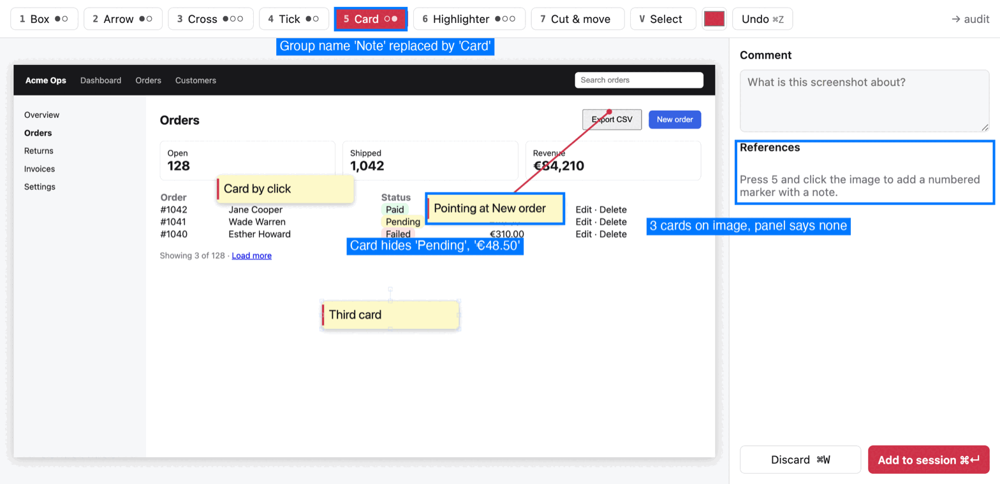;
  with twelve markers "Add to session" is below the fold and the comment is one clipped line
  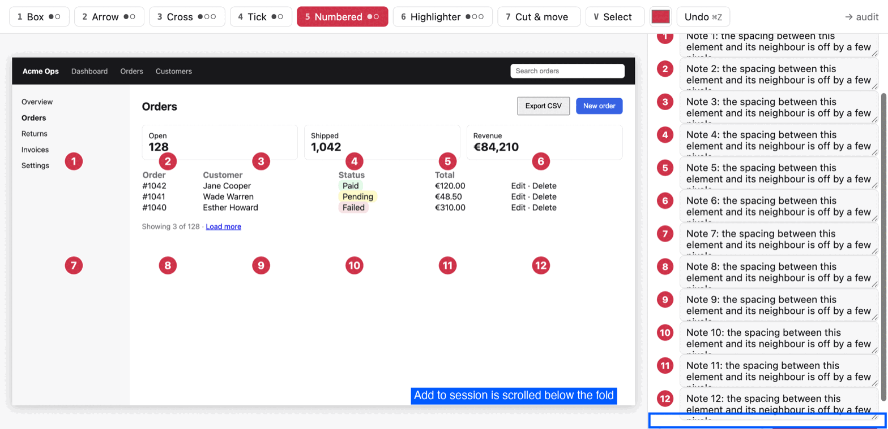.
  **Proposal:** "Notes · 1 Customer column too narrow · 2 Status colours unexplained · Card A Load more
  should be a button · Move M1 · Remove 1 · Approve 2", comment below, buttons pinned.
- **Applies to:** editor side panel, editor canvas.

Supporting notes

- Resolves: F015 (list route to select), F016, F030, F031, F039, F040, F081, F102, F114 (design choice: typing beside the marker, left to decision), F152 (row per move).
- Accessibility rule 5 from the accessibility review (every mark has a text form in the side panel, the alt text and session.md) lives here and in "The text says what the image shows".
- Today: only markers become rows (`src/editor.ts:565-594`); the whole `aside` scrolls (`src/editor.html:115-123`); rows are rebuilt on each change (`replaceChildren`).
- Other products: Figma comments open beside their pin and list in a panel.

### Dialogs, menus and popovers

#### Interrupt only to protect work; choose from menus

- **Status:** proposed
- **Situation:** any question, choice or extra surface.
- **Rule:**
  - A dialog appears only when the next step would lose work that cannot be recovered. Today that is
    leaving an editor with marks or text (⌘W, "Discard screenshot", the window's close button, Quit).
  - It is a sheet on the editor window: "Discard this screenshot? 3 marks and 1 note will be lost." with
    **Keep editing** (default, Return and Esc) and **Discard** (⌘⌫). The buttons name the action.
  - An untouched screenshot closes at once, with no question.
  - Choices that change nothing irreversibly are menus, not dialogs: the session label in the editor
    opens a menu; each session in "Switch session" has its own submenu.
  - Native dialogs say what they are for: the folder dialog carries a message ("Choose where Snapmark
    saves sessions. Pick a folder in iCloud Drive or Google Drive to sync them.") and a button that names
    the action ("Use this folder").
  - Nothing opens on top of a sheet.
- **Why it helps:** the reviewer is interrupted only when it matters, and the safe choice is always the
  one under their finger.
- **Tradeoff:** one more key press for a deliberate discard of a marked-up screenshot. The alternative is
  no question but a way to reopen a discarded screenshot (kept in "Confirmation and undo" as a safety
  net either way).
- **Exceptions:** the capture overlay is macOS's own and keeps its own keys (Esc cancels, Space toggles
  window mode).
- **Example:** today "Discard ⌘W" closes the window at once
  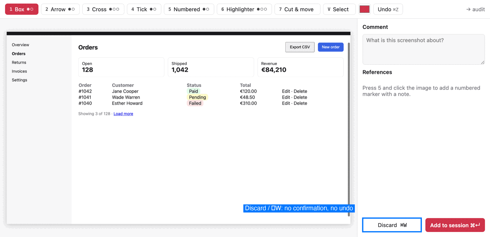.
  **Proposal:** the sheet above, attached to the editor window.
- **Applies to:** editor window, Quit, sessions folder dialog, menu bar menu.

Supporting notes

- Resolves: F001, F002, F003, F007, F115 (the question), F146, F147; menus: F043, F044, F121.
- Today: there are no dialogs in the editor; the folder dialog sets only `title`, which macOS open panels do not show, and no `buttonLabel` (`src/main.ts:46-50`).
- Other products: macOS Screenshot markup asks before throwing away edits.

### Saving and unsaved work

#### One save per screenshot, every way out is safe, and every state shows

- **Status:** proposed
- **Situation:** from capture to "Add to session", and every way of leaving an editor.
- **Owner's words:** "This is also important: when I create, as I said, it needs to be shortcuts so I can just do this on the fly." — 2026-09-25
- **Rule:**
  - Nothing is written until "Add to session" (⌘↵, which works everywhere in the editor, including in text fields).
  - Every exit goes through one check: ⌘W (also inside a text field), "Discard screenshot", the window's
    close button, Quit, a restart and any reload. With marks or text, it asks (see "Interrupt only to
    protect work"); without, it closes.
  - Quit with work open brings the first such editor forward and asks once for all:
    "2 screenshots are not in a session yet. [Review] [Quit anyway]".
  - The four save states are always visible on the button and beside it:
    - ready: "Add to session ⌘↵";
    - adding: dimmed, "Adding…", further ⌘↵ and clicks ignored;
    - added: the window closes and one confirmation names the number and the session (see "Confirm what leaves the editor");
    - failed: the window stays, the marks stay, the button comes back, and a message under it says what
      happened: "Couldn't add to 'Checkout review': the folder is read-only. [Try again] [Add to another session…]".
- **Why it helps:** a reflexive ⌘W beside ⌘Z and ⌘↵ never throws away ten minutes of marks, and a
  failed write to a cloud folder never leaves a dead button with the only exit being Discard.
- **Tradeoff:** Quit and close are no longer instant while work is open.
- **Exceptions:** a screenshot with nothing drawn or typed closes silently, so a bad capture is still one key.
- **Example:** today a failed save leaves the button looking enabled but dead, with no message
  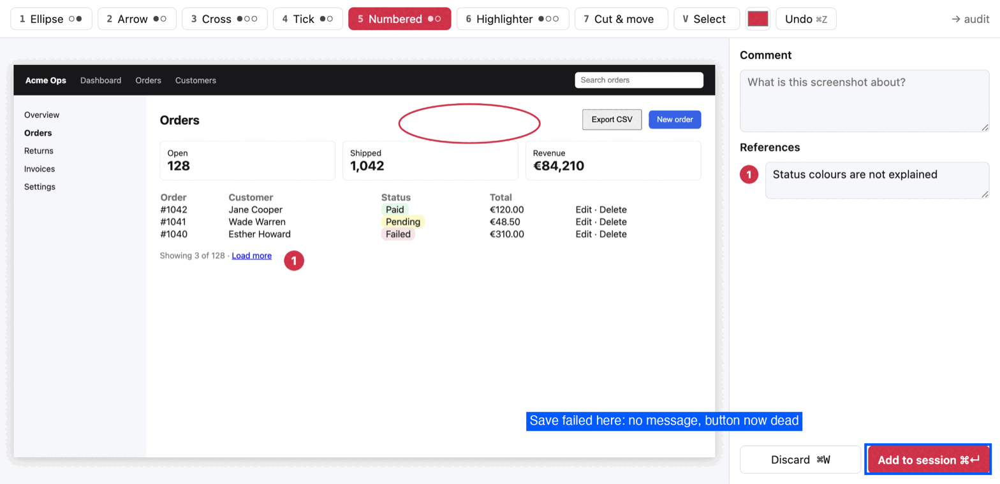.
  **Proposal:** the failed state above, at the foot of the side panel.
- **Applies to:** editor window, menu bar Quit, application menu.

Supporting notes

- Resolves: F001, F002, F003, F004, F007, F019, F068, F115, F182 (reload), with F020 for the confirmation.
- Today: `⌘W` is checked before the text-field branch (`src/editor.ts:613`); `cancel.onclick = () => window.close()` (`:630`); no `close`, `beforeunload` or `before-quit` handling (`src/main.ts:77-86`, `:180`); the image is deleted on `closed` (`:84`); `save()` has no try/catch and never re-enables the button (`src/editor.ts:596-609`); ⌘↵ calls `save()` even while disabled (`:612`); the disabled button has no style (`src/editor.html:162-177`).

### Confirmation and undo

#### Undo what can be undone; say what cannot, before it happens

- **Status:** proposed
- **Situation:** deleting, clearing, discarding, replacing and moving things.
- **Rule:**
  - Inside the editor everything happens at once and can be undone: deleting a mark, clearing a card,
    removing a row, recolouring, moving. Undo puts things back exactly, including a marker's number.
  - Discarding a screenshot with work asks first (see "Interrupt only to protect work"). As a safety net,
    the last discarded screenshot can be reopened from the menu ("Reopen last screenshot") until Snapmark quits.
  - Outside the editor, an action that replaces or leaves something behind says so before or as it happens:
    - export: "Replaces the PDF exported at 14:30" (or each export gets its own name, see decision);
    - changing the sessions folder: "Your 12 sessions stay in ~/Documents/Snapmark. [Move them too] [Leave them]".
  - A saved screenshot can be removed again ("Remove last screenshot", see "A saved screenshot can be fixed").
- **Why it helps:** mistakes cost ⌘Z, and the only questions left are about things that really cannot come back.
- **Tradeoff:** a discarded screenshot lingers in a temporary folder until Snapmark quits.
- **Exceptions:** a text field keeps its own ⌘Z while the cursor is in it (see "One history per screenshot").
- **Example:** today deleting marker 1 and pressing ⌘Z brings it back as 3
  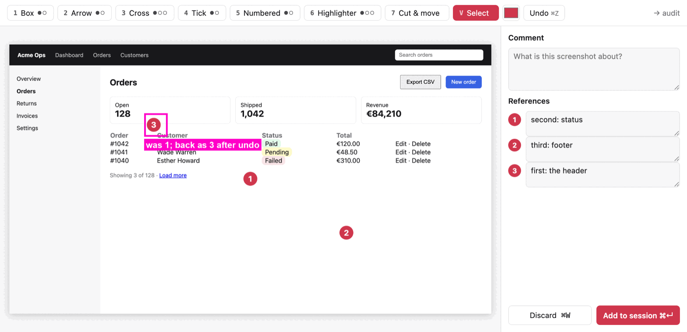.
  **Proposal:** it comes back as 1, with its note.
- **Applies to:** editor, menu bar menu (Reopen last screenshot, Export, Change where sessions are saved).

Supporting notes

- Resolves: F006, F010, F029, F144, F172, F176; related F180.
- Today: no confirmation anywhere; the capture is deleted on close (`src/main.ts:84`); undo re-adds with `canvas.add(...)`, which appends (`src/editor.ts:507-515`); exports `rmSync` then rewrite (`src/exporter.ts:13-14`, `:39`).
- Other products: Xnapper and CleanShot keep a capture history.

### Feedback and notifications

#### Confirm what leaves the editor, once; keep failures where they happened

- **Status:** proposed
- **Situation:** any result of an action, success or failure.
- **Owner's words:** "I also wonder: where do I access the session? Is this in the toolbar of my Mac? Is this where I am supposed to see it or where would I see that?" — 2026-09-25
- **Rule:**
  - Inside the editor the changed thing is the feedback: the mark appears, the tool button changes. No toast.
  - Every action whose result leaves the editor window is confirmed once, briefly, naming the object,
    in a macOS notification that replaces the previous one of its kind:
    "Added 004 to Checkout review · Open session.md", "Prompt for Checkout review copied",
    "Path to session.md copied", "PDF exported · Show in Finder", "New session: Checkout review",
    "Sessions are now saved in iCloud Drive/Snapmark", and for a manual update check "Snapmark 0.2.0 is up to date".
  - A failure reads event · consequence · action, in plain words and macOS key symbols, never raw error
    text: "Couldn't export the PDF: the disk is full. Free some space, then export again." "⌘⇧1 is used
    by another app, so Capture region has no shortcut. Choose another in Shortcuts…"
  - Anything the reviewer still needs after the banner fades lives in the menu too: a shortcut that is
    not registered shows as "Capture region (shortcut unavailable)"; a downloaded update as "Restart to
    install 0.3.0"; the session line shows the screenshot count.
  - A failed capture says so ("Capture failed. No screenshot was taken."); a deliberate Esc stays silent.
  - For VoiceOver, one polite announcement per tool change and per added or deleted mark ("Remove:
    Crossed box, 2 of 3", "Cross added").
- **Why it helps:** at the hand-off moment of the main scene the reviewer knows the prompt is on the
  clipboard, and after capture 8 knows it landed as 008 in the right session.
- **Tradeoff:** a notification per save can feel noisy over 20–30 captures; replacing the previous one
  keeps the Notification Centre to one line. The quieter alternative is the count in the menu alone.
- **Exceptions:** background update checks stay silent unless an update is found.
- **Example:** today the menu's "Copy prompt for AI" closes and nothing confirms it, and a failed export
  shows "Error: Command failed: zip -r -X -q …".
  **Proposal:** "Prompt for Checkout review copied. Paste it into Claude Code."
- **Applies to:** notifications, menu bar menu, editor (announcements), capture.

Supporting notes

- Resolves: F020, F098, F118, F123, F124, F125, F126, F136, F140, F142, F143, F145, F178 (update promise), F129 (count).
- Accessibility rule 10 from the accessibility review (every result confirmed in words that VoiceOver reads) lives here.
- Today: save returns `n` and it is thrown away (`src/main.ts:114-119`, `src/editor.ts:602`); `clipboard.writeText` with nothing else (`src/main.ts:160`); `body: String(e)` (`:135-141`); `${key} is taken by another app` (`:198`); `checkForUpdatesAndNotify().catch(console.error)` (`:121-124`); capture errors ignored (`:66-69`); no live region in the editor.
- Writing: event · consequence · action; no system words (`references/writing.md`).

### Progress and long operations

#### Show progress on the control that started it

- **Status:** proposed
- **Situation:** saving a screenshot, exporting a PDF or ZIP, loading a large capture.
- **Rule:** anything that can take longer than about half a second shows it on the control that started
  it and ignores repeats until it ends: "Adding…" on the button; "Exporting PDF…" (disabled) in the menu
  until the confirmation appears; "Loading screenshot…" on a grey canvas until the image is ready, with
  the tools disabled. The reviewer can keep working elsewhere: other editors and captures stay usable
  during an export. Export cannot be cancelled; it is short and writes one file.
- **Why it helps:** no second export or double entry from a click that seemed to do nothing.
- **Tradeoff:** a menu item that changes label is easy to miss once the menu is closed; the
  confirmation notification covers the end.
- **Exceptions:** none.
- **Example:** today the disabled "Add to session" looks exactly like the enabled one.
  **Proposal:** "Adding…", dimmed.
- **Applies to:** editor button and canvas, menu Export session.

Supporting notes

- Resolves: F019, F068, F074, F171, F175.
- Today: `saveBtn.disabled = true` with no disabled style; exports render in a hidden window with no status (`src/main.ts:135-141`, `src/exporter.ts:31-45`); clicks before the image loads are ignored (`src/editor.ts:434`).

### Navigation and return

#### The menu bar menu is home, and it reaches every session and every open editor

- **Status:** proposed
- **Situation:** finding the session, an older session, or an editor that fell behind other windows.
- **Owner's words:** "It needs to be some sort of project or session. If there's an existing session I just add to the existing session or I create a new session." — 2026-09-25
- **Rule:**
  - The first line names the active session with its count and opens it: "Checkout review · 7 screenshots".
    Before the first session it gives the next step: "No session yet: press ⌘⇧1 to capture and start one".
  - "Open editors (2) ▸" lists screenshots waiting in open editors and brings one forward.
  - "Switch session ▸" lists recent sessions by last use. Each has its own submenu: Make active · Open
    session.md · Copy prompt for AI · Copy path to session.md · Export ▸. The list ends with
    "Other session…" (a chooser in the sessions folder that reaches every session) and says how many are hidden.
  - Acting on an older session never makes it the capture target unless "Make active" is chosen.
  - The menu is rebuilt each time it opens, so sessions added, renamed or removed in Finder or by sync show at once.
  - "Sessions are saved in ~/Documents/Snapmark" opens that folder.
- **Why it helps:** after a month of daily reviews every session is two clicks away, and last week's
  session can be exported for a teammate without sending tonight's captures there.
- **Tradeoff:** deeper submenus; one more section in a menu that already has 13 items.
- **Exceptions:** the menu is native and follows macOS menu keys (arrows, Return, type to select).
- **Example:** today "Switch session" shows the first 20 folders in reverse name order, so a folder
  renamed "Checkout review" jumps above every dated one and the 21st session is unreachable.
  **Proposal:** "Checkout review · 7 screenshots / … / Switch session ▸ Checkout review ▸ Make active ·
  Open session.md · Copy prompt for AI · Copy path · Export ▸ / … / Other session… (14 more)".
- **Applies to:** menu bar menu, sessions chooser.

Supporting notes

- Resolves: F117, F121, F127, F129, F130, F131, F133, F134 (position of Copy prompt), F181.
- Today: `list.slice(0, 20)` of `sessions.list()`, which sorts folder names and reverses them (`src/main.ts:155`, `src/sessions.ts:17-25`); the menu is rebuilt only from `saveState` (`src/main.ts:32-36`); the session and folder lines are `enabled: false` (`:149`, `:167`); the Dock icon is hidden (`:187`).
- Other products: Figma recents plus search; Xnapper history (reported).

#### The editor names its session, keeps it, and links to it

- **Status:** proposed
- **Situation:** an open editor, while sessions change around it.
- **Owner's words:** "I also wonder: where do I access the session? Is this in the toolbar of my Mac? Is this where I am supposed to see it or where would I see that?" — 2026-09-25
- **Rule:**
  - The session appears in words beside the button that writes to it ("Session: Checkout review ▾",
    directly above "Add to session") and in the window title ("Snapmark — Checkout review").
  - The label opens a menu: Open session.md · Show in Finder · Copy prompt for AI · Add to another session ▸ · New session….
  - An open editor keeps the session it was captured for. When the reviewer switches or starts a
    session while editors are open, the confirmation says so: "New session: Pricing page. 1 open
    screenshot still goes to Checkout review."
  - The editor shows the number this screenshot will get ("will be 008").
  - New editors open 24 px down and right of the last one, like document windows.
- **Why it helps:** the reviewer cannot add to the wrong session without seeing it, and never has to
  leave the editor to check or change where the screenshot goes.
- **Tradeoff:** the label and number take space in a panel that is already full at 1180 px; an editor
  that does not follow a switch can surprise someone who expected it to.
- **Exceptions:** none.
- **Example:** today the only clue is a grey "→ audit" in the far corner, and the window title reads "Snapmark"
  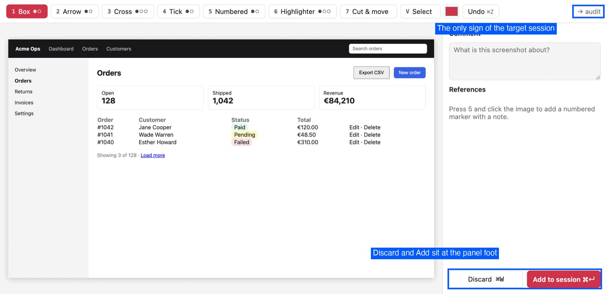.
  **Proposal:** "Session: Checkout review ▾ · will be 008" above "Add to session ⌘↵".
- **Applies to:** editor side panel and window title, menu (switch, new session, change folder).

Supporting notes

- Resolves: F013, F021, F043, F044, F069, F070, F071, F072, F168 (number shown early).
- Today: each editor fixes `{ image, root, session }` when it opens (`src/main.ts:73-83`); the page `<title>Snapmark</title>` replaces the window title (`src/editor.html:6`); `→ ${session}` (`src/editor.ts:644`); no `x`/`y` on new windows.
- Decision left open by F021: follow the active session or keep the capture's. This rule proposes "keep".

#### A saved screenshot can be found and fixed

- **Status:** proposed
- **Situation:** noticing after capture 8 that capture 3 marked the wrong button.
- **Owner's words:** "Basically reviewing the designs, doing a complete UX/UI review of an overnight build, providing detailed feedback on different elements. I want to be able to draw inside the screenshots, also copy and paste stuff around, and work." — 2026-09-25
- **Rule:** the marks are kept as data next to each saved image, so a saved screenshot can be reopened
  in the editor and saved over itself. At minimum, the menu offers "Edit last screenshot" and "Remove
  last screenshot". The session can be seen as rendered pages ("Preview session"), not only as raw Markdown.
- **Why it helps:** a stale or wrong entry never has to stay in the file the agent reads.
- **Tradeoff:** more files per session; session.md is rewritten, not only appended to.
- **Exceptions:** entries saved before this change are flat images and can only be removed.
- **Example:** today a saved screenshot can only be changed by editing session.md by hand.
  **Proposal:** menu "Edit last screenshot" reopens 008 with its marks and notes.
- **Applies to:** menu bar menu, editor, session.md.

Supporting notes

- Resolves: F137, F180.
- Today: `addShot` appends only (`src/sessions.ts:36-64`); the canvas is flattened on save (`src/editor.ts:603`).
- Other products: macOS Screenshot keeps edits until the thumbnail is dismissed; Xnapper and CleanShot reopen from history (reported).

### Lists and selection

#### Select, edit and delete are separate, with a key for each

- **Status:** proposed
- **Situation:** marks on the canvas, rows in the side panel, sessions in the menu.
- **Rule:**
  - Click selects a mark; Shift-click adds to the selection; a drag across empty canvas in Select selects
    every mark it touches. A move or delete of several marks is one undo step.
  - Double-click or Enter edits: on a card its text, on a marker its note row.
  - ⌫ or Delete removes the selection, only when the screenshot has focus.
  - Tab and Shift+Tab step through marks while the screenshot has focus in Select; a row in the side
    panel selects its mark.
  - Sessions list by last use, newest first, whatever their folder name.
- **Why it helps:** moving a card with its marker, or deleting five stray marks, is one action, and the
  same keys work on the canvas and in the list.
- **Tradeoff:** more undo bookkeeping, which is why one-at-a-time was chosen.
- **Exceptions:** "Switch session" is a native menu and follows macOS menu behaviour.
- **Example:** today dragging across the canvas selects nothing
  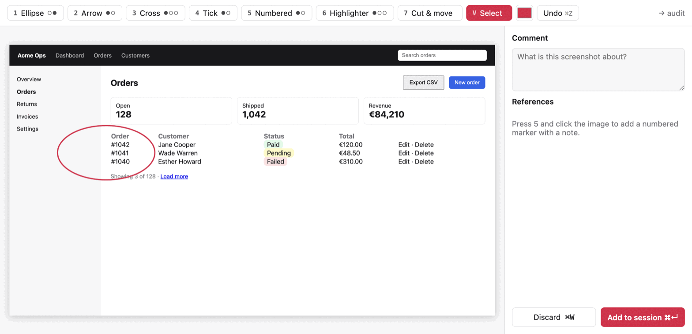.
  **Proposal:** drag across three crosses in Select, press ⌫: all three go; ⌘Z brings all three back.
- **Applies to:** editor canvas and side panel, menu bar menu.

Supporting notes

- Resolves: F015, F030, F036, F060, F081, F117 (order).
- Today: `selection: false // one object at a time keeps undo simple` (`src/editor.ts:84`); Backspace deletes whenever a mark is selected, whatever has focus (`:620-622`); sessions sorted by name, reversed.
- Other products: macOS markup Shift-click; Figma marquee and Shift-click.

### Forms and validation

#### Nothing is required; flag, never block; write the text as typed

- **Status:** proposed
- **Situation:** the comment, marker notes, card text and naming a session.
- **Rule:**
  - No field is required. A marker without a note is flagged in its row ("No note yet", outlined) before
    saving, but "Add to session" never stops on it; in session.md it reads "(marker only: see the image)".
  - Every field has a label that stays when text is typed ("Note for marker 1"); placeholders never
    carry the label.
  - Text is written as typed: a comment starting with "#" stays text, a note with several lines stays one
    numbered item (its extra lines indented), card line breaks stay line breaks.
  - Keys in every field: Return adds a line; ⌘↵ saves the screenshot; Esc leaves the field and gives
    the keys back to the tools; clicking outside leaves the field and keeps the text.
  - A failed save keeps every value on screen.
  - "New session…" asks for an optional name with the date and time already filled in; Return accepts
    it as is. "Rename session…" in the menu renames the active one.
- **Why it helps:** the reviewer is never stopped mid-flow, and the agent always gets the note numbers
  the reviewer saw on screen.
- **Tradeoff:** Markdown in comments and notes is lost; ⌘⇧2 needs one Return.
- **Exceptions:** none.
- **Example:** today a comment "# Orders page overnight build" becomes a top-level heading in the file
  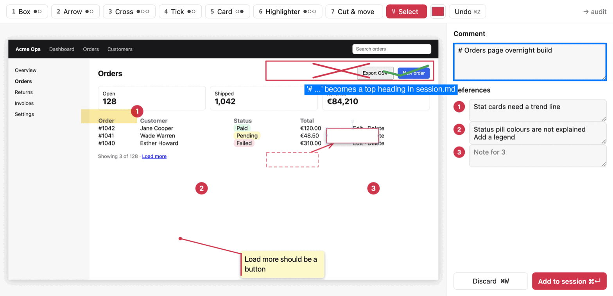.
  **Proposal:** it is written as the literal line "# Orders page overnight build".
- **Applies to:** editor side panel, card text, session.md, New session.

Supporting notes

- Resolves: F064, F085, F116 (naming), F150, F159, F161, F162.
- Today: `<label>References</label>` tied to nothing and placeholders as names (`src/editor.html:191`, `src/editor.ts:585-590`); notes not joined or indented, cards joined with " / " (`src/sessions.ts:54`, `:56`); the comment written raw (`:53`); session names are timestamps (`:14-15`).

#### Fields, buttons and pressed tools can be seen and read

- **Status:** proposed
- **Situation:** every piece of the editor's own interface, in light and dark appearance.
- **Rule:** text meets 4.5:1 and control edges 3:1 against their background, in light and dark,
  including pressed tool buttons, their key digits and dots, placeholders and disabled states. Controls
  take their colours from one set of tokens that declares both appearances. A dark screenshot has a thin
  light edge in dark appearance.
- **Why it helps:** the active tool, the thing checked before every mark, is readable on every button.
- **Tradeoff:** a slightly heavier look; the pressed Approve button green differs a little from the mark green.
- **Exceptions:** marks on the screenshot follow "Red means remove, green means approve" (halos), not this rule.
- **Example:** today the pressed "4 Tick" is white on green at 3.3:1
  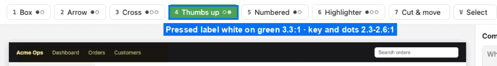.
  **Proposal:** white on a darker green (about 5:1).
- **Applies to:** editor toolbar, side panel, canvas surround; light and dark.

Supporting notes

- Resolves: F054, F055, F065, F073, F095, F096.
- Accessibility rule 8 from the accessibility review lives here.
- Today: pressed label on `#16a34a` 3.3:1 and on `#ca8a04` 2.94:1; key digit at 70% opacity 2.18–2.88:1; placeholder `#757575` 3.85:1 in dark; borders `#e4e4e7` 1.27:1 (`src/editor.html:8-24`, `:71-88`, `:127-136`).

### Keyboard and focus

#### A tool key gives the same tool every time

- **Status:** proposed
- **Situation:** picking tools with 1–7 and V.
- **Owner's words:** "When I press the same button multiple times, let's say I have the 1 button, I would switch between the shapes and it would indicate it at the top." — 2026-09-25
- **Rule:**
  - A new editor opens with Select active, so the first press of any number picks that group's first tool.
  - Pressing the key of another group picks that group's first tool.
  - Pressing the key of the active group again keeps the tool, so "5, click, 5, click" gives two markers.
  - Shift plus the number moves to the group's next tool, and the button shows it at the top, as today.
  - Tool buttons keep a fixed width, so cycling never moves the buttons after them.
- **Why it helps:** "press 5, click" means the same thing on the first marker and the tenth, which is
  the rhythm of the main scene.
- **Tradeoff:** this changes the gesture the owner asked for: repeating a key no longer cycles, Shift
  does. The alternative keeps cycling on repeat and fixes only the first press (a group's first tool
  when coming from another group), which leaves the second-marker trap.
- **Exceptions:** single-tool groups (7, V) are unaffected.
- **Example:** today pressing 5 again for the next marker makes an empty card
  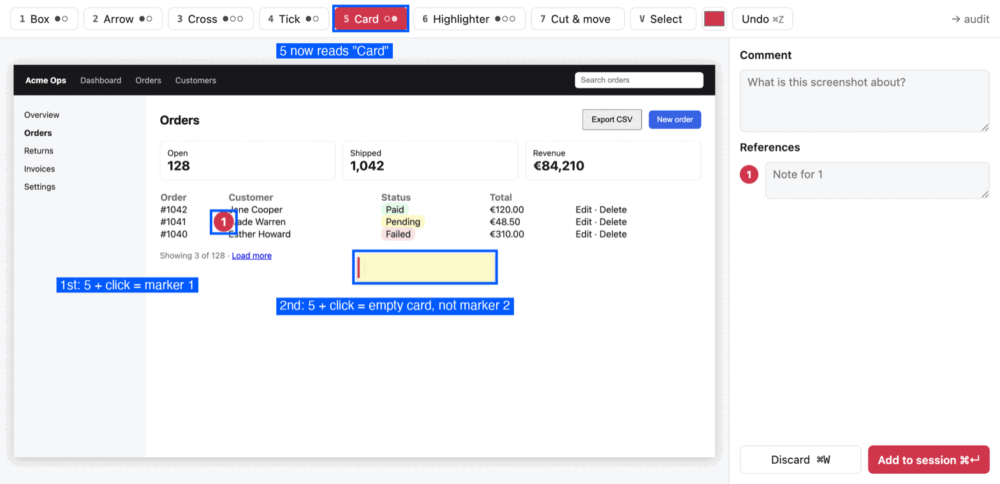,
  and the first 1 draws an ellipse.
  **Proposal:** 5, click → marker 1; 5, click → marker 2; Shift+5 → "5 Card".
- **Applies to:** editor toolbar, keyboard.

Supporting notes

- Resolves: F008, F009, F023, F078.
- Today: `pickGroup` cycles when `g === group` (`src/editor.ts:305-309`); `group = 0` and the last-used variant per group are remembered (`:90-91`); buttons have no fixed width.
- Other products: Figma keeps Rectangle on a repeat of R; Xnapper one key per tool.

#### Keys act where the reviewer is, and focus is never lost

- **Status:** proposed
- **Situation:** any key press in the editor.
- **Rule:**
  - Plain keys (1–7, V, ⌫, arrows, ?) act only when the screenshot or the toolbar has focus. In a text
    field they type.
  - ⌘ keys work everywhere in the editor: ⌘↵ saves, ⌘Z/⇧⌘Z undo and redo (text undo inside a field),
    ⌘W goes through the leave check, and ⌘ plus a number picks a tool even from inside a note.
  - Esc, in order: cancels a drag in progress; leaves a text field (focus returns to the screenshot);
    deselects. Esc never discards.
  - After placing a marker the cursor goes into its note, and the field says how back:
    "Note for marker 1 · Esc to go back to the tools".
  - When the editor opens, the screenshot has focus. After an action focus stays on the control used,
    or moves to what the action created; it never falls to the page. Clicking a tool button does not
    take focus from the screenshot; Tab still reaches every button.
- **Why it helps:** a digit typed into a note stays in the note, a Backspace on the Discard button never
  deletes a hidden mark, and a keyboard or VoiceOver user never loses their place.
- **Tradeoff:** ⌘+number is a second set of shortcuts; after typing, Esc is needed before plain keys work
  again, which is already true today.
- **Exceptions:** inside a text field ⌘Z is the field's own undo (a macOS convention).
- **Example:** today pressing Space on a tool button sends focus back to the page
  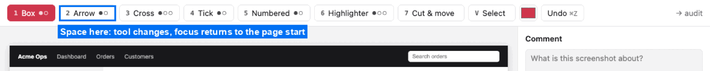,
  and Backspace with focus on Discard deletes the selected cross
  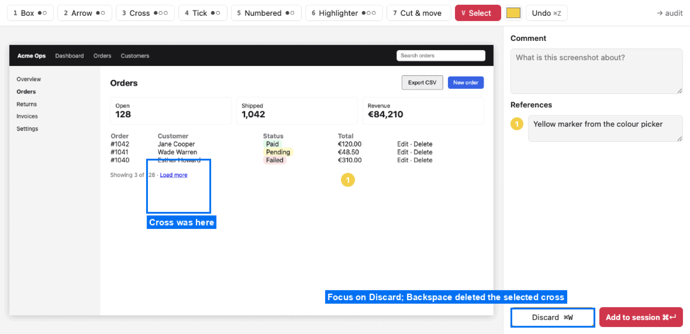.
  **Proposal:** focus stays on "2 Arrow"; Backspace on Discard does nothing.
- **Applies to:** editor window.

Supporting notes

- Resolves: F007, F022, F052, F060, F086, F087, F097.
- Accessibility rules 3 (focus never falls to the page) and 4 (keys act where they are used) from the accessibility review live here.
- Today: the key handler (`src/editor.ts:611-625`) acts anywhere outside a textarea; ⌘W runs before the text-field check; the toolbar is rebuilt on every change (`toolsEl.replaceChildren`, `:325-344`); Ctrl+number also picks a tool (undocumented).
- WCAG 2.1.4 Character Key Shortcuts, 2.4.3 Focus Order.

#### Every pointer action has a keyboard route

- **Status:** proposed
- **Situation:** placing, selecting, moving and resizing marks, and capturing.
- **Owner's words:** "This is also important: when I create, as I said, it needs to be shortcuts so I can just do this on the fly." — 2026-09-25
- **Rule:**
  - The screenshot takes focus. With a drawing tool, the arrow keys move a crosshair (Shift ×10); Enter
    places a click-size mark; Enter, arrows, Enter draws a sized box, arrow, card or cut. Esc cancels.
  - With Select, Tab steps through marks, arrow keys move the selected mark, Option+arrows resize it,
    ⌫ deletes, Enter edits.
  - Every tool drawn with a drag also works with two clicks: one for the start, one for the end, with a
    visible "waiting for the end point" state.
  - Capturing needs no pointer: besides "Capture region ⌘⇧1", the menu has "Capture front window" and
    "Capture screen", each with a shortcut.
- **Why it helps:** a keyboard-only reviewer can do the whole job, and a fast reviewer can stay on the keys.
- **Tradeoff:** new input code; slower than a pointer for most people; two more global shortcuts that
  can collide with other apps.
- **Exceptions:** freehand Pen stays pointer-only, because a path cannot be drawn with keys; the capture
  overlay is macOS's own.
- **Example:** today Tab never reaches the screenshot
  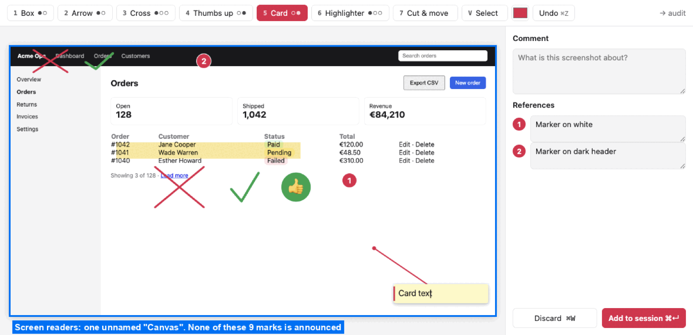.
  **Proposal:** a crosshair on the screenshot, arrows to move it, Enter to place
  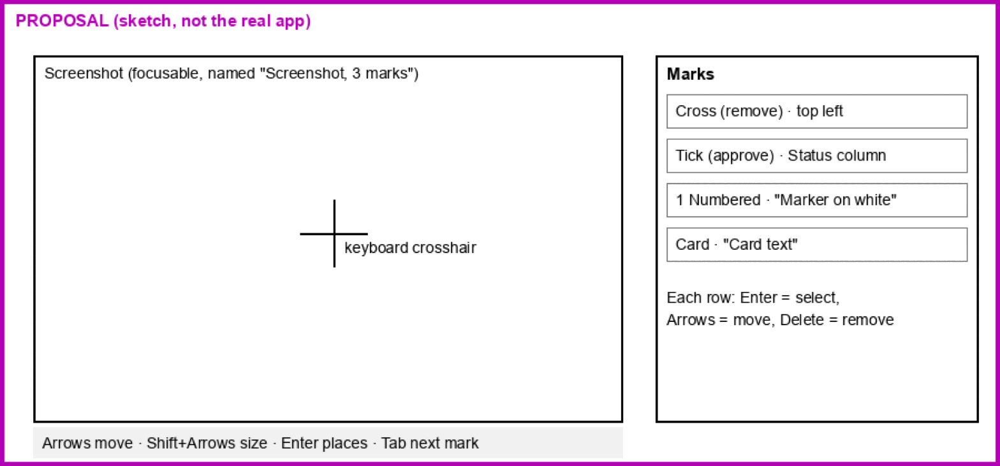.
- **Applies to:** editor canvas, menu bar menu, global shortcuts.

Supporting notes

- Resolves: F014, F015, F053, F058, F059, F063, F141.
- Accessibility rules 1 (every tool that draws or edits a mark works without a pointer, Pen excepted) and 2 (every drag has a click or keyboard alternative) from the accessibility review live here.
- Today: all placement is in `mouse:down`/`mouse:up` (`src/editor.ts:432-490`); the canvas has no tabindex (`src/editor.html:187`); arrow is dropped on a click, redact and cut need a drag (`:476-482`); capture is `screencapture -i -x` only (`src/main.ts:64-70`).
- WCAG 2.1.1 Keyboard (A), 2.5.7 Dragging Movements (AA).

#### Every control says what it is and what state it is in

- **Status:** proposed
- **Situation:** every button, field, the screenshot and the window, as read by VoiceOver.
- **Rule:** every control has a name that says what it does, and its state (pressed, disabled, which of
  several) is exposed, not only drawn:
  - tool buttons: "Remove: Cross, 1 of 3", pressed; the dots hidden from screen readers; the cycle as the button's description;
  - the colour control: "Mark colour", disabled when a fixed-colour group is active;
  - the screenshot: "Screenshot, 8 marks";
  - the card typing field: "Card text";
  - the window title carries the session.
- **Why it helps:** a VoiceOver user hears which tool is active and what is on the screenshot.
- **Tradeoff:** none for sighted users.
- **Exceptions:** none.
- **Example:** today a tool button reads "3 Cross black circle white circle white circle"
  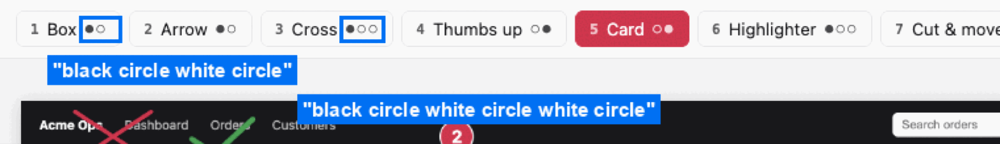.
  **Proposal:** "Remove: Cross, 1 of 3".
- **Applies to:** editor window.

Supporting notes

- Resolves: F016, F062, F064, F069, F076, F094, F099 (language declared).
- Accessibility rule 9 from the accessibility review lives here.
- Today: two unnamed canvas nodes; `title="Color"` (`src/editor.html:183`); Fabric's hidden textarea unnamed; dots in the button name (`src/editor.ts:331-339`); no `lang` (`src/editor.html:2`).

### Search and filters

- **Status:** not applicable
- **Reason:** Snapmark has no search or filters, and still has none with the planned Chrome extension,
  which adds a second way to capture, not a place to browse. Finding an older session is covered by "The
  menu bar menu is home" ("Other session…"). Revisit if sessions become browsable inside the app, or
  when more than about 50 sessions is normal.

### Undo across the app

#### One history per screenshot, with Redo, that names its steps

- **Status:** proposed
- **Situation:** ⌘Z, ⇧⌘Z and the Undo button in an editor.
- **Rule:**
  - Each editor has one history covering every change to the screenshot and its text: adding, deleting,
    moving, resizing and recolouring marks, card text, clearing a card, and note and comment edits once
    the field is left (grouped per edit, not per keystroke).
  - ⌘Z undoes, ⇧⌘Z redoes; both restore exactly, including stacking order and marker numbers.
  - Undo and Redo are disabled when there is nothing to undo or redo, and their tooltip names the step
    ("Undo delete marker 3").
  - A step that has no visible effect is never left in the history (an empty new card leaves none).
  - The history lives as long as the editor window. What cannot be undone is said before it happens
    (see "Undo what can be undone"): discarding a screenshot, replacing an export, leaving sessions behind.
- **Why it helps:** one ⌘Z too many is never final, and ⌘Z does the same thing whatever has focus.
- **Tradeoff:** every step must work in both directions; text undo needs sensible grouping.
- **Exceptions:** while the cursor is in a text field, ⌘Z and ⇧⌘Z are that field's own.
- **Example:** today there is no Redo and the Undo button is live on a fresh screenshot
  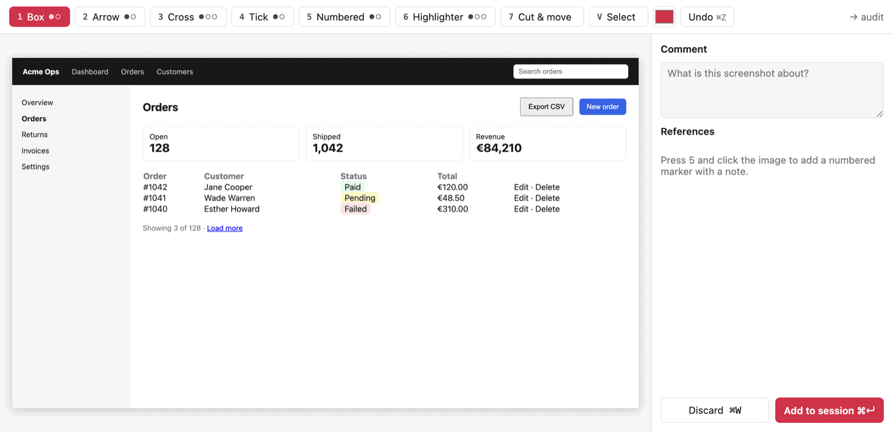.
  **Proposal:** "[Undo ⌘Z] [Redo ⇧⌘Z]", both greyed until the first mark.
- **Applies to:** editor toolbar and keyboard.

Supporting notes

- Resolves: F010, F029, F047, F048, F049, F082, F083, F084.
- Today: the history is a list of unnamed one-way functions (`src/editor.ts:88`, `:552-556`); no ⇧⌘Z branch (`:611-625`); note fields rebuilt on each marker change lose their native history (`:575-589`); the Undo button is never disabled (`src/editor.html:184`).

### Copy and paste

#### Copy, cut, paste and duplicate marks; paste images; copy the session path

- **Status:** proposed
- **Situation:** the main scene, placing the same mark several times; images from elsewhere; handing a path to an agent.
- **Owner's words:** "Basically reviewing the designs, doing a complete UX/UI review of an overnight build, providing detailed feedback on different elements. I want to be able to draw inside the screenshots, also copy and paste stuff around, and work." — 2026-09-25 · "One thing, actually, from the menu item: I want to be able to copy and paste the path to the Markdown from the current session. I just paste it and then I can point the AI to it." — 2026-09-25
- **Rule:**
  - ⌘C, ⌘X, ⌘V and ⌘D work on the selected marks, as undoable steps, within one screenshot and between
    open editors. Option-drag duplicates. A pasted mark lands a few pixels offset, or at the pointer.
  - A pasted marker takes the next number and gets an empty note row; a pasted card keeps its text and
    drops its pointer; a pasted cut piece is a piece with no move attached.
  - ⌘V with an image on the clipboard (and no mark copied since) pastes it as a movable piece.
  - The menu offers "Mark up clipboard image", which opens an editor on it.
  - The menu offers "Copy path to session.md" directly under "Copy prompt for AI", confirmed like it.
- **Why it helps:** the same cross, tick or card goes on three places with one copy and three pastes,
  and the reviewer can point an agent at the session in one paste.
- **Tradeoff:** pasted markers renumber; the editor's own clipboard and the system clipboard must not
  surprise each other.
- **Exceptions:** text fields keep the standard text copy and paste.
- **Example:** today ⌘C, ⌘V and ⌘D on a selected box leave one box.
  **Proposal:** select the tick on "Paid", ⌘D twice, drag the copies onto "Shipped" and "Refunded".
- **Applies to:** editor canvas, menu bar menu, clipboard.

Supporting notes

- Resolves: F011, F037, F120.
- Today: no C, V or D handling and no `copy`/`paste` listener (`src/editor.ts:611-625`); the prompt carries the path inside three sentences (`src/main.ts:127-133`).
- Other products: macOS markup, Figma and Xnapper copy and duplicate annotations with ⌘C, ⌘V, ⌘D; Figma pastes images and across files.

### Drag and drop

#### Drag on the canvas has an alternative; a file dropped from Finder never replaces the editor

- **Status:** proposed
- **Situation:** dragging inside the screenshot, and dragging files in from Finder.
- **Rule:**
  - Inside the screenshot a drag draws, moves or resizes, and a target shows it will accept by the
    pointer changing and the piece or mark following it. Every drag has a click or keyboard alternative
    (see "Every pointer action has a keyboard route").
  - An editor window never navigates away from the editor, whatever is dropped on it.
  - One image file dropped on the screenshot becomes a movable piece. Several images: the first becomes a
    piece, and the side panel says how many were not used. A file that is not an image, or cannot be read,
    is refused where it was dropped: "Can't use 'notes.pdf': only images can be dropped here."
  - Folders are refused the same way.
- **Why it helps:** a stray drag of a file onto the editor cannot throw the marks away, and a Figma
  export can be dropped straight onto the build it belongs to.
- **Tradeoff:** accepting drops is new input to test with large images.
- **Exceptions:** dropping on the menu bar icon is not proposed; "Mark up clipboard image" covers opening
  an image from elsewhere.
- **Example:** today a file dropped on the editor may load in its place and lose the marks (not tested; no
  drop handling exists). **Proposal:** drop "mock.png" on the screenshot: it appears as a piece with handles.
- **Applies to:** editor window.

Supporting notes

- Resolves: F038, F058.
- Accessibility rule 2 from the accessibility review applies here too.
- Today: no `drop`, `dragover` or `will-navigate` handling in `src/` (`src/main.ts:77-82`); verified status of F038: assumption, not checked.

### Media playback

- **Status:** not applicable
- **Reason:** Snapmark plays no audio or video, and the planned Chrome extension captures still images.

### Platform conventions

#### Behave like a macOS menu bar app

- **Status:** proposed
- **Situation:** keys, menus and windows that macOS users already know.
- **Owner's words:** "It should work on Mac OS mainly and may also boot up on startup with options but that's secondary." — 2026-09-25
- **Rule:**
  - The menu bar menu stays the home and the place for settings (no ⌘,). No Dock icon, except while an
    editor is open if the owner prefers (see "The menu bar menu is home").
  - Editors have Snapmark's own minimal application menu: Edit (Undo, Redo, Cut, Copy, Paste, Duplicate,
    Select All), View (Zoom In ⌘+, Zoom Out ⌘−, Actual Size ⌘0, Show key list ?), Window (Close ⌘W), and
    Quit Snapmark ⌘Q. There is no Reload and no developer tools in the shipped app.
  - ⌘W, the close button and ⌘Q go through the leave check (see "One save per screenshot").
  - Right-click: in a text field, the standard text menu; on a mark, Delete, Duplicate, Bring to front, Send to back.
  - Shortcuts are shown with macOS symbols (⌘⇧1), never code names. The two global shortcuts can be
    changed in "Shortcuts…" in the menu.
  - Menu labels follow macOS: an ellipsis when a dialog follows; "Quit Snapmark".
- **Why it helps:** nothing the reviewer's hands already know does something different here.
- **Tradeoff:** a little more code to keep in step with the keys; the first settings window in the app (shortcuts).
- **Exceptions:** the capture overlay, notifications and the folder dialog are macOS's own and keep its behaviour.
- **Example:** today the app sets no menu of its own, so Electron's stock menu, with Reload ⌘R, may be
  active in the editor (not checked). **Proposal:** ⌘R does nothing; Edit › Duplicate ⌘D duplicates the selected mark.
- **Applies to:** editor windows, menu bar menu, global shortcuts, notifications.

Supporting notes

- Resolves: F115, F142 (key symbols), F182, F183, F189; with F003 through the leave check.
- Today: no `Menu.setApplicationMenu` (`src/main.ts`); `role: 'quit'` with no `before-quit` (`:180`); shortcuts fixed (`:11-12`); no context-menu handling.
- Other products: macOS Screenshot shortcuts are editable in System Settings; Xnapper and CleanShot record custom shortcuts.

#### The editor fits the window and can be zoomed

- **Status:** proposed
- **Situation:** small screens, split screens, 200% zoom and detailed reviews of large captures.
- **Rule:**
  - The editor window cannot be made smaller than 1180 × 600, the size at which the whole toolbar fits.
  - At large text sizes the toolbar shrinks labels to keys and the side panel narrows in proportion, so
    every control stays on screen at 200% zoom at the minimum window size.
  - The screenshot opens fitted to the window; ⌘+, ⌘− and ⌘0 (Actual Size) and pinch zoom it; Space-drag
    pans. A capture is never shown larger than its real pixels at 100%.
- **Why it helps:** Undo and the session never slide out of view, and a table row in a full-window
  capture can be marked precisely.
- **Tradeoff:** a hard minimum is awkward on a small screen split in two; zoom and pan add state to track.
- **Exceptions:** none.
- **Example:** today at 900 px wide Undo and the session name are cut off
  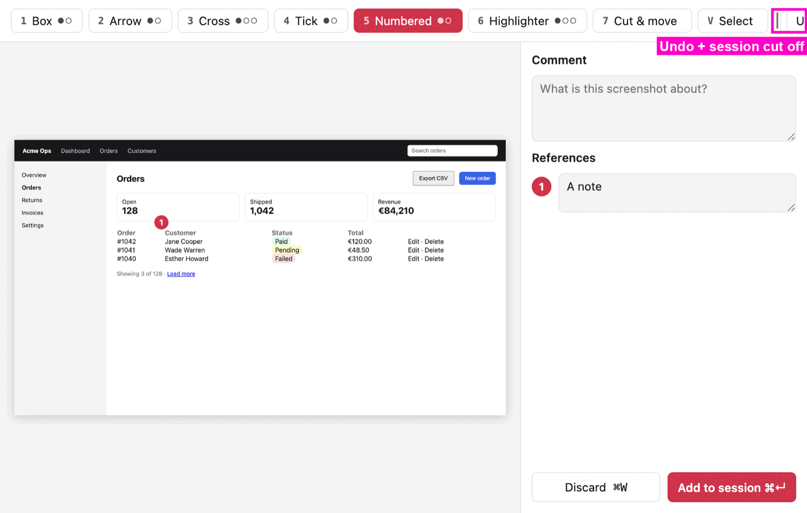,
  and at 200% half the toolbar is off screen
  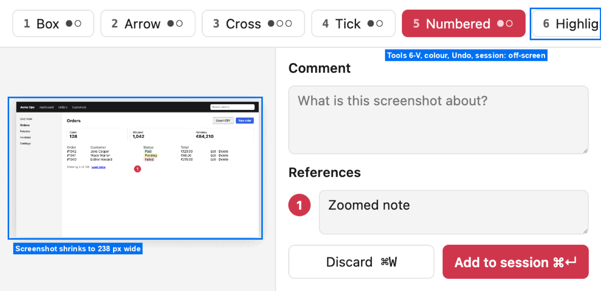.
  **Proposal:** the window stops at 1180 px; "[−] [100% ▾] [+] [Fit]" under the screenshot.
- **Applies to:** editor window.

Supporting notes

- Resolves: F018, F042, F061, F079, F113 (toolbar budget: design choice, left to decision), F157 (warn when scaled down a lot).
- Accessibility rule 13 from the accessibility review (the editor stays usable at 200% zoom at its minimum window size) lives here.
- Today: the comment says "1180 px minimum" but no `minWidth` is set (`src/main.ts:76-82`); `overflow-x: auto` on the header (`src/editor.html:42-43`); scale is capped at 1 (`src/editor.ts:633-639`); `enableRetinaScaling: false`.

### Local work and external writes

#### A write either happens completely or not at all, and says what it replaces

- **Status:** proposed
- **Situation:** writing a screenshot into a session, exporting, changing the sessions folder, and
  sessions in iCloud Drive or Google Drive, where files can be missing, read-only or not yet synced.
- **Owner's words:** "Also I wonder what the best way of making this portable is: being able to share this as a PDF or zip it, maybe both. Having it in the cloud." — 2026-09-25
- **Rule:**
  - The editor is local work; the session folder is the external write. The image and its text are
    written as one step: if either fails, neither is left behind, so "Try again" can never add the entry twice.
  - Before an editor opens and before it saves, Snapmark checks the session is still there. If it is
    not: "Checkout review is no longer in ~/Documents/Snapmark (moved, deleted or still syncing).
    [Add to another session…] [Show sessions folder]", and the marks stay.
  - "Open session.md" and "Show in Finder" say so when the file or folder has gone, with the same two ways out.
  - Exports say whether they replace an earlier export (or each gets its own name; see decision), and a
    failure says why in plain words.
  - Changing the sessions folder offers to move existing sessions, and says where they stay if not;
    afterwards it confirms the new folder and the active session.
- **Why it helps:** a session in a cloud folder that went away mid-review never costs the screenshot,
  and a teammate's PDF never changes under them without the reviewer knowing.
- **Tradeoff:** moving sessions into a syncing folder is a real write with its own failures (full disk,
  sync conflicts); checks at use time cost a file lookup.
- **Exceptions:** none.
- **Example:** today with the session's folder read-only, "Add to session" goes dead with no message
  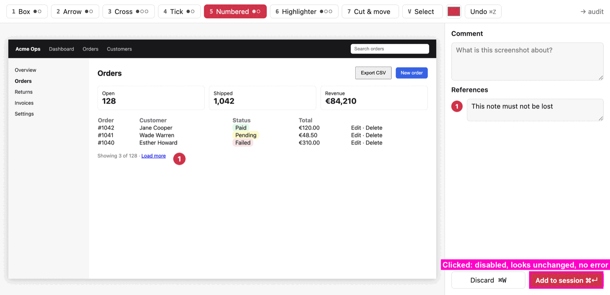.
  **Proposal:** the message and the two ways out above.
- **Applies to:** save, menu Open session.md, Show in Finder, Export, Change where sessions are saved.

Supporting notes

- Resolves: F004, F125, F126, F133, F144, F145, F172, F176.
- Today: `addShot` writes the PNG, then appends to session.md, reading session.md first, which can throw (`src/sessions.ts:36-64`); `shell.openPath` results ignored (`src/main.ts:158-159`); existence checked only at launch (`:29`); `chooseRoot` moves nothing and picks the new folder's first session (`:44-55`).

#### The text says what the image shows

- **Status:** proposed
- **Situation:** everything Snapmark writes for someone else to read: session.md, the copied prompt, the PDF and the ZIP.
- **Owner's words:** "It's basically for providing feedback to AI in a nice and token-efficient way." — 2026-09-25
- **Rule:**
  - session.md starts with one line explaining the marks, generated from the same list of tools as the
    toolbar and the prompt, so no tool is left out: "Marks: red cross, crossed box or hatched area =
    remove · green tick or thumbs up = approved, keep as is · numbered circle = note below · lettered card
    = text on the image · dashed outline and arrow = move · pixelated = hidden on purpose".
  - Each entry is headed with the first line of its comment ("## 004 · Orders table: status colours"),
    with the date when it differs from the session's, and gives:
    - a line listing the remove and approve marks by kind and rough position;
    - numbered notes that match the markers on the image;
    - cards labelled with the letter drawn on the card, with what they point at;
    - moves labelled M1, M2 on the image and in the text, with an optional note, written only once the piece has moved;
    - the comment, labelled.
  - The image's alt text carries the comment's first line and a count of marks by kind.
  - The PDF opens with the same key, has the session name as its title, declares English, and is tagged
    (headings, lists, alt text).
  - Images are saved at a size chosen for review (for example 1000 px on the long edge, full size as an
    option), and the editor warns when a capture will be scaled below half.
  - The copied prompt is the key plus the path; one number style ("Screenshot 4") and one time format everywhere.
- **Why it helps:** an agent, a teammate reading the PDF and a screen reader all learn what should go
  and what should stay without decoding colours in the picture, at about half the tokens.
- **Tradeoff:** a few more words per entry; smaller images lose fine detail, so size is a choice.
- **Exceptions:** none.
- **Example:** today an entry with a red cross and a green tick says only "Orders table · 1. Column
  headers are grey on grey; raise contrast". **Proposal:**
  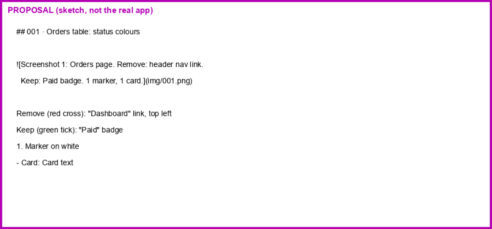
  "Orders table · Remove: 1 cross (right third) · Approve: 1 tick (left) · 1. Column headers are grey on grey; raise contrast".
- **Applies to:** session.md, Copy prompt for AI, PDF export, ZIP export, saved images.

Supporting notes

- Resolves: F119, F148, F149, F151, F152, F153, F154, F155, F156, F157, F158, F160, F163, F164, F165, F166, F167, F169, F170, F173, F174; F138 (prompt for new entries only: design choice, left to decision).
- Accessibility rules 5 (every mark has a text form) and 12 (exports are accessible documents: language, title, tags, headings with words, real alt text) from the accessibility review live here.
- Today: save sends notes, card text and a move count only (`src/editor.ts:602-608`); the key exists only in the prompt (`src/main.ts:127-133`); headings are number and time, alt text "Screenshot n" (`src/sessions.ts:51-52`); `printToPDF` without tagging, export page with no `<title>` or `lang` (`src/exporter.ts:21`, `:38`); images capped at the model's own limit (`src/main.ts:101-112`).
- Token estimate for a ten-screenshot session: about 10,450 tokens, 96% images (findings appendix A8).

### Connection to external systems

- **Status:** not applicable
- **Reason:** nothing connects except the update check, which is covered by "Confirm what leaves the
  editor". Cloud sync is done by iCloud Drive or Google Drive, not by Snapmark; its failures reach
  Snapmark as missing or unsynced files and are covered by "A write either happens completely or not at
  all". **Revisit for the planned Chrome extension:** the owner said "In its first version it should just
  work on screenshots. In a second version it should also work as a Chrome extension or something, which
  I connect to my desktop app." — 2026-09-25. When it is built, this area needs a rule for: the extension
  connected, disconnected, or the desktop app not running; a capture sent while disconnected; which
  session an extension capture goes to; and what the extension shows after reconnecting.

### Remembered state

#### Remember where work goes, not how the last screenshot was drawn

- **Status:** proposed
- **Situation:** what persists between editors, sessions and launches.
- **Rule:**
  - Remembered across launches: the sessions folder, the active session, each session's last use (for
    the menu order), the pointing-mark colour, custom shortcuts, "Open at login", and whether the first-run
    hint has been shown.
  - Remembered until Snapmark quits: the last discarded screenshot (for "Reopen last screenshot").
  - Not remembered: the tool. Every editor opens with Select active, so a number key always gives that
    group's first tool (see "A tool key gives the same tool every time").
  - Window size follows the capture; new editors cascade.
  - Everything is global, not per session.
- **Why it helps:** the reviewer never re-picks their colour or their session, and a key press on a new
  screenshot is always predictable.
- **Tradeoff:** a reviewer who uses markers on every screenshot presses 5 every time. The alternative
  (open on the last tool used) is faster for repeat work but makes the first key press depend on history.
- **Exceptions:** none.
- **Example:** today every editor opens on "1 Box" in red, and a card used once makes 5 give a card from then on.
  **Proposal:** every editor opens on "V Select" in the reviewer's last pointing colour.
- **Applies to:** editor on open, menu bar menu, state kept on disk.

Supporting notes

- Resolves: F106 (design choice), with F009 and F023.
- Today: `state.json` holds `active` and `root` only (`src/main.ts:22-36`); tool, variant and colour are set fresh per editor (`src/editor.ts:90-91`, `src/editor.html:183`).

### First run and help

#### The first launch shows where Snapmark lives and gets the first capture right

- **Status:** proposed
- **Situation:** from "Open Anyway" to the first saved screenshot.
- **Owner's words:** "I also wonder: where do I access the session? Is this in the toolbar of my Mac? Is this where I am supposed to see it or where would I see that?" — 2026-09-25
- **Rule:**
  - On the first launch only, one notification: "Snapmark is in your menu bar. Press ⌘⇧1 to capture a region."
  - Before a capture, Snapmark checks Screen Recording permission. If it is missing: "Snapmark needs
    Screen Recording to see your apps. [Open System Settings]", then "[Restart Snapmark]" once granted.
    It never opens an editor on the wallpaper alone.
  - The menu's first line gives the next step until a session exists (see "The menu bar menu is home").
  - The first capture's automatically created session is confirmed like any new session.
  - Until the app is signed, the menu does not promise an automatic update: "Updates: download from GitHub…".
- **Why it helps:** a new user, or a teammate the owner shares the app with, reaches a useful first
  screenshot without the README.
- **Tradeoff:** one extra notification, once; permission behaviour must be tested across macOS versions.
- **Exceptions:** the macOS "Open Anyway" step before the first launch stays until signing, as the owner
  asked: "defer delveoper-id to later. do the rest in the meantime" — 2026-09-25. The README and release
  page show it with a picture.
- **Example:** today the first launch shows nothing but a small icon, and without permission the editor
  opens on the desktop picture. **Proposal:** the notification and the permission guide above.
- **Applies to:** first run, capture, menu bar menu, README.

Supporting notes

- Resolves: F127, F139, F177, F178, F179.
- Today: `app.dock?.hide()`, tray, wait (`src/main.ts:185-200`); no permission check before `screencapture` (`:64-70`); first session created silently (`:73`).
- Other products: CleanShot and Xnapper open a permission guide with a restart button.

#### Help lives in the app and is always true

- **Status:** proposed
- **Situation:** learning the tools and keys without reading the README.
- **Owner's words:** "I want shortcuts, like just pressing 1, 2, 3, 4, 5 while I'm in the editor." — 2026-09-25
- **Rule:**
  - Each toolbar button shows its group's meaning and its current tool ("3 Remove · Cross").
  - Every tool of a group is visible without cycling: a second line or a popover on long-press names them.
  - The side-panel hint follows the active tool, one line per tool, and is true in every state: with Card
    active, "Click to place a card. Drag from the element to where the card goes to add a pointer."
  - Tooltips say what the tool does ("Select, move, resize or delete a mark (⌫)"), and the same text is the
    button's description for keyboard and VoiceOver users.
  - "?" in the editor and "Keyboard shortcuts…" in the menu open one key list, generated from the same
    table as the toolbar and the README's key section, so the three never disagree. "Help" opens the README.
  - One key style everywhere: the label, then the key in muted text.
- **Why it helps:** Esc, V, ⌫, Shift+number and the card pointer are learned from the app, and a hint
  never sends the reviewer to the wrong tool.
- **Tradeoff:** more text in a toolbar already full at 1180 px (see "The editor fits the window"); the
  key list must be kept in step with behaviour, which generating it does.
- **Exceptions:** none.
- **Example:** today the only hint says "Press 5" while 5 gives a card
  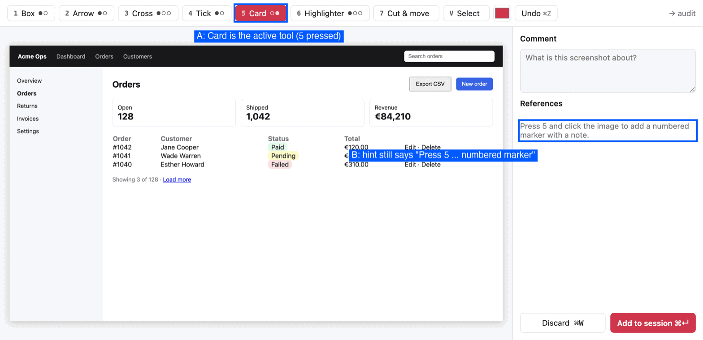.
  **Proposal:** the hint above for Card, and "5 Note · Marker" on the button.
- **Applies to:** editor toolbar and side panel, menu bar menu, README.

Supporting notes

- Resolves: F023, F024, F025, F026 (Redact's place: decision), F045, F046, F088, F089, F092, F105, F128, F190.
- Today: the one hint is a constant (`src/editor.ts:80`); group names only in `title` (`:339`); no "?" and no help item (`src/main.ts:147-181`); README "no export step" contradicts the Export menu.

#### One name for each thing, everywhere

- **Status:** proposed
- **Situation:** every word on screen, in notifications, in session.md, the prompt, the PDF and the README.
- **Rule:** each object, action and state has one name, taken from the glossary, used in every place;
  one word never names two things. In particular: "marker" for the numbered circle and "note" only for its
  text; "screenshot" for the thing and "capture" only as the action; "mark" for anything drawn; "approve"
  for the green group; "session folder" for one session and "where sessions are saved" for the parent.
  Buttons name their action and object ("Discard screenshot").
- **Why it helps:** a first-time reviewer and the agent read one word for one idea, so "reference",
  "numbered" and "note" are never mistaken for three things.
- **Tradeoff:** "References" is the owner's own first word; renaming touches the README, prompt and toolbar at once.
- **Exceptions:** none.
- **Example:** today the numbered circle is "Numbered" on its button, "numbered marker" in the hint,
  "References" above its list and "Note for 1" in its field
  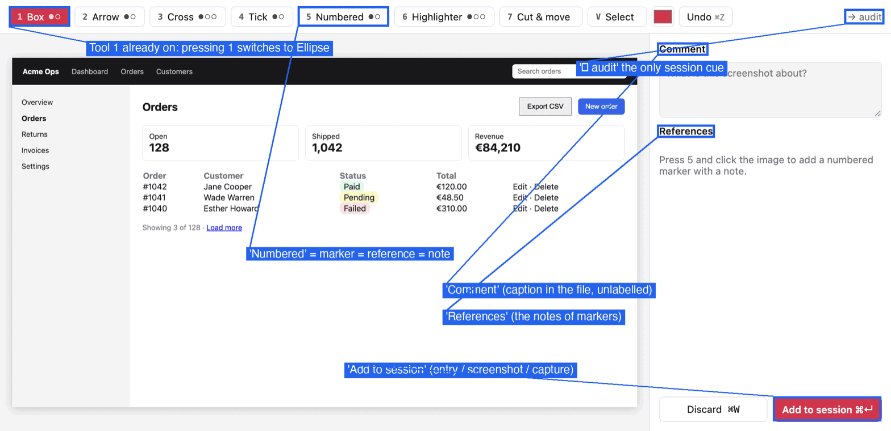.
  **Proposal:** "5 Note · Marker", heading "Notes", field "Note for marker 1".
- **Applies to:** every surface.

Supporting notes

- Resolves: F071, F090, F093, F122, F184, F185, F186, F187, F188; the proposed words are in the glossary proposal.
- Today: strings are spread through `src/editor.ts`, `src/editor.html`, `src/main.ts`, `src/sessions.ts` and the README.

### Motion

#### Motion only explains a change, briefly, and never with Reduce Motion on

- **Status:** proposed
- **Situation:** any animation.
- **Rule:** Snapmark has no motion today, and that is the default. Motion is added only where it explains
  a change the reviewer might miss (for example a new editor arriving, or the menu bar icon confirming a
  save), lasts under 200 ms, and is replaced by an instant change when Reduce Motion is on. Nothing moves
  for decoration.
- **Why it helps:** captures stay instant, and nothing moves under the pointer while marking.
- **Tradeoff:** none today.
- **Exceptions:** macOS's own window and notification animations.
- **Example:** today nothing animates. **Proposal:** if the save confirmation becomes a menu bar icon
  flash, it is one 150 ms pulse, and a still tick with Reduce Motion.
- **Applies to:** editor, menu bar icon.

Supporting notes

- Resolves: no finding; the audit found no motion (WCAG 2.2.2 and 2.3.3 pass or not applicable).
- Related: F020 (a menu bar flash is one of the confirmation options).

## Flows

Each flow is set in one of the three scenes. **Today** is what v0.2.0 does; **Proposal** is what the
proposed rules would make it. A dash means the step is the same.

Minimum flows from the rule areas, and how they apply to Snapmark:

| Minimum flow                                                               | Snapmark flow below                                                  |
| -------------------------------------------------------------------------- | -------------------------------------------------------------------- |
| Rename an item from a list                                                 | 1. Rename a session                                                  |
| Edit a document and leave with unsaved work                                | 2. Leave a marked-up screenshot                                      |
| Compare and edit several items                                             | 3. Adjust several marks and their notes                              |
| Delete an item and recover it                                              | 4. Delete a mark or a screenshot and get it back                     |
| Send or write to an external system: success, failure, partial             | 5. Add to a session in a cloud folder                                |
| Search, open a result, come back to the same results                       | 6. Find an older session, act on it, come back (no search exists)    |
| Drag files in from the operating system, including one that cannot be read | 7. Drop images onto a screenshot                                     |
| Lose the connection in the middle of a job and get it back                 | 8. The session folder goes missing mid-review (no connection exists) |
| First launch up to the first useful result                                 | 18. First launch up to the first saved screenshot                    |
| Media playback                                                             | not applicable: no media                                             |

### 1. Rename a session

**Scene:** reviewing an overnight build. A week of sessions all read "2026-09-2x hh.mm"; the reviewer
wants tonight's to read "Checkout review".

| #   | Pointer                              | Keyboard                                   | Today                                                                               | Proposal                                                                         |
| --- | ------------------------------------ | ------------------------------------------ | ----------------------------------------------------------------------------------- | -------------------------------------------------------------------------------- |
| 1   | Click the menu bar icon              | Ctrl+F8 (or VoiceOver), arrows to Snapmark | Menu opens: "Session: 2026-09-25 14.30" (grey)                                      | "2026-09-25 14.30 · 0 screenshots"                                               |
| 2   | Choose "Rename session…"             | Arrows, Return                             | No such item; only Finder can rename, which moves the folder to the top of the list | A small field with the current name selected                                     |
| 3   | Type "Checkout review", click Rename | Type, Return (Esc cancels)                 | —                                                                                   | Folder and session.md heading renamed; notification "Renamed to Checkout review" |
| 4   | Open "Switch session"                | Arrows                                     | —                                                                                   | "Checkout review" is first because it was used last, not because of its name     |

Alternative at creation: ⌘⇧2 asks "New session name" with the date and time filled in; Return keeps it.

### 2. Leave a marked-up screenshot

**Scene:** reviewing an overnight build. Screenshot 6 has a cross, two markers and a half-written note.

| #   | Pointer                                 | Keyboard                  | Today                                               | Proposal                                                                                     |
| --- | --------------------------------------- | ------------------------- | --------------------------------------------------- | -------------------------------------------------------------------------------------------- |
| 1   | Click in note 2, type "Half-written"    | Type                      | —                                                   | —                                                                                            |
| 2   | Click "Discard" or the red close button | ⌘W (even inside the note) | Window closes at once; screenshot and marks deleted | Sheet: "Discard this screenshot? 3 marks and 2 notes will be lost. [Keep editing] [Discard]" |
| 3   | Click "Keep editing"                    | Return or Esc             | —                                                   | Back in note 2, cursor where it was                                                          |
| 4   | Menu bar › Quit Snapmark                | ⌘Q                        | Every editor closes; all lost                       | Editor comes forward: "1 screenshot is not in a session yet. [Review] [Quit anyway]"         |
| 5   | Click "Discard" deliberately            | ⌘⌫                        | —                                                   | Closes; menu offers "Reopen last screenshot" until Snapmark quits                            |

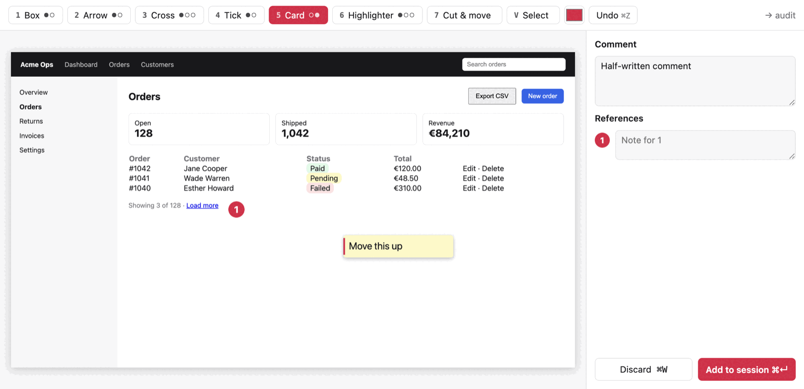

An untouched screenshot (nothing drawn or typed) still closes with one ⌘W, no question.

### 3. Adjust several marks and their notes

**Scene:** reviewing an overnight build. Twelve markers on a dashboard; three stray crosses; note 8 needs rewording.

| #   | Pointer                       | Keyboard                                       | Today                                                | Proposal                                 |
| --- | ----------------------------- | ---------------------------------------------- | ---------------------------------------------------- | ---------------------------------------- |
| 1   | Click marker 8                | V, Tab to marker 8                             | Marker gets a faint frame; its row does not move     | Row 8 highlighted and scrolled into view |
| 2   | Click row 8, edit the note    | Enter (focuses the note), type, Esc            | Must match the number by eye                         | —                                        |
| 3   | Drag across the three crosses | Tab to each, Shift+Tab… (or rows in the panel) | Drag selects nothing; one mark at a time             | All three selected                       |
| 4   | Press ⌫                       | ⌫ (screenshot focused)                         | One at a time                                        | All three deleted as one step            |
| 5   | Scroll the panel to save      | ⌘↵                                             | With ~10 markers, "Add to session" is below the fold | Buttons pinned at the panel foot         |

### 4. Delete a mark or a screenshot and get it back

**Scene:** a quick verdict. The reviewer deletes marker 1 by mistake, then discards the whole screenshot by mistake.

| #   | Pointer                                               | Keyboard        | Today                                       | Proposal                                                            |
| --- | ----------------------------------------------------- | --------------- | ------------------------------------------- | ------------------------------------------------------------------- |
| 1   | Select marker 1, press ⌫                              | V, Tab to it, ⌫ | Deleted, note too                           | —                                                                   |
| 2   | Click Undo                                            | ⌘Z              | Comes back as marker 3, note at the bottom  | Comes back as 1, note in place; tooltip read "Undo delete marker 1" |
| 3   | ⌘Z once too often                                     | ⌘Z              | The earlier mark is gone for good (no Redo) | ⇧⌘Z redoes it                                                       |
| 4   | Click "Discard screenshot", then Discard in the sheet | ⌘W, ⌘⌫          | (no sheet) screenshot deleted from disk     | Closes                                                              |
| 5   | Menu › Reopen last screenshot                         | Menu keys       | Not possible                                | Editor reopens with every mark and note                             |

### 5. Add to a session in a cloud folder

**Scene:** sharing with a person. Sessions live in iCloud Drive so a teammate sees them.

| #   | Pointer                                          | Keyboard    | Today                                                          | Proposal                                                                                                                          |
| --- | ------------------------------------------------ | ----------- | -------------------------------------------------------------- | --------------------------------------------------------------------------------------------------------------------------------- |
| 1   | Click "Add to session"                           | ⌘↵          | Button disabled, looks unchanged                               | "Adding…", dimmed; a second ⌘↵ is ignored (today it adds a duplicate)                                                             |
| 2a  | Success                                          | —           | Window vanishes; nothing says where it went                    | Window closes; notification "Added 004 to Checkout review · Open session.md"; menu count 4                                        |
| 2b  | Failure: folder read-only, not synced, disk full | —           | Window stays, button dead, no message; only way out is Discard | Marks stay; under the button: "Couldn't add to 'Checkout review': the folder is read-only. [Try again] [Add to another session…]" |
| 2c  | Partial: the image was written, the text was not | —           | Image left in img/; a retry writes a second number             | Nothing is left behind; "Try again" writes one entry                                                                              |
| 3   | Click "Add to another session…"                  | Tab, Return | —                                                              | Session menu; the screenshot goes there and the failure clears                                                                    |

### 6. Find an older session, act on it, come back

**Scene:** sharing with a person. A teammate asks for last month's "Pricing page" review as a PDF;
tonight's session must stay the capture target.

| #   | Pointer                     | Keyboard       | Today                                                         | Proposal                                                                                 |
| --- | --------------------------- | -------------- | ------------------------------------------------------------- | ---------------------------------------------------------------------------------------- |
| 1   | Menu › Switch session       | Arrows         | First 20 folders by reversed name; last month's is not listed | Recent by last use, then "Other session… (14 more)"                                      |
| 2   | Click "Other session…"      | Return         | Not possible (Finder only)                                    | Chooser in the sessions folder; pick "Pricing page"                                      |
| 3   | Pricing page ▸ Export ▸ PDF | Arrows, Return | Only possible after making it active                          | Exports without making it active; "Exporting PDF…", then "PDF exported · Show in Finder" |
| 4   | ⌘⇧1 for the next capture    | ⌘⇧1            | Would land in Pricing page if it had been made active         | Lands in tonight's session, which never changed                                          |

### 7. Drop images onto a screenshot

**Scene:** reviewing an overnight build. The reviewer drags a Figma export of the intended header, and
by mistake a PDF, from Finder onto the editor.

| #   | Pointer                               | Keyboard                               | Today                                                                             | Proposal                                                                         |
| --- | ------------------------------------- | -------------------------------------- | --------------------------------------------------------------------------------- | -------------------------------------------------------------------------------- |
| 1   | Drag "header.png" over the screenshot | — (keyboard route: copy the image, ⌘V) | No drop handling; the file may replace the editor and lose the marks (not tested) | Pointer shows it will be accepted                                                |
| 2   | Drop                                  | ⌘V                                     | —                                                                                 | Appears as a movable piece with handles; one undo step                           |
| 3   | Drop "notes.pdf"                      | —                                      | —                                                                                 | Refused where dropped: "Can't use 'notes.pdf': only images can be dropped here." |
| 4   | Drop three images at once             | —                                      | —                                                                                 | The first becomes a piece; the panel says "2 more images were not used"          |

### 8. The session folder goes missing mid-review

**Scene:** reviewing an overnight build. The sessions folder is in Google Drive; the Drive app signs out
while three editors are open. Snapmark has no connection of its own, so this is the nearest case.

| #   | Pointer                             | Keyboard | Today                                    | Proposal                                                                                                                                    |
| --- | ----------------------------------- | -------- | ---------------------------------------- | ------------------------------------------------------------------------------------------------------------------------------------------- |
| 1   | Add to session in editor 1          | ⌘↵       | Silent failure, dead button              | "Checkout review is no longer in Google Drive/Snapmark (moved, deleted or still syncing). [Add to another session…] [Show sessions folder]" |
| 2   | Open the menu                       | Ctrl+F8  | Stale list; Open session.md does nothing | Menu rebuilt on open; the missing session greyed with "(missing)"                                                                           |
| 3   | Drive comes back; click "Try again" | Return   | —                                        | Entry added once; editors 2 and 3 save normally                                                                                             |

### 9. Capture, mark, save, capture the next one

**Scene:** reviewing an overnight build. The tenth screen of the night, two notes.

| #   | Pointer                           | Keyboard                                                                                 | Today                                                      | Proposal                                                              |
| --- | --------------------------------- | ---------------------------------------------------------------------------------------- | ---------------------------------------------------------- | --------------------------------------------------------------------- |
| 1   | —                                 | ⌘⇧1, drag a region (or Space, click a window; or "Capture front window" with no pointer) | Editor opens on "1 Box" in red, on top of any other editor | Opens on Select, cascaded; "Session: Checkout review ▾ · will be 010" |
| 2   | Click "1", drag around the header | 1, Enter, arrows, Enter                                                                  | First 1 gives Ellipse                                      | Box                                                                   |
| 3   | Click "5", click the button       | 5, arrows, Enter                                                                         | Marker 1; cursor in its note                               | — ; field reads "Esc to go back to the tools"                         |
| 4   | Type the note                     | Type, Esc                                                                                | A tool key typed here goes into the note                   | ⌘+number picks a tool from the note                                   |
| 5   | Click the next target             | 5, arrows, Enter                                                                         | Second 5 gives an empty card                               | Marker 2                                                              |
| 6   | Click "Add to session"            | ⌘↵                                                                                       | Window vanishes                                            | "Added 010 to Checkout review"                                        |
| 7   | —                                 | ⌘⇧1                                                                                      | —                                                          | —                                                                     |

### 10. Start a new session and switch back to an older one

**Scene:** reviewing an overnight build. Mid-review the reviewer starts a separate session for a bug,
then returns.

| #   | Pointer                                               | Keyboard       | Today                                                                   | Proposal                                                            |
| --- | ----------------------------------------------------- | -------------- | ----------------------------------------------------------------------- | ------------------------------------------------------------------- |
| 1   | Menu › New session…                                   | ⌘⇧2            | New dated session at once; notification "New session: 2026-09-25 15.20" | Name field, time filled in; Return keeps it                         |
| 2   | (an editor is open)                                   | —              | The open editor still saves to the old session, silently                | Notification adds "1 open screenshot still goes to Checkout review" |
| 3   | Capture the bug, add                                  | ⌘⇧1 … ⌘↵       | —                                                                       | "Added 001 to Login bug"                                            |
| 4   | Menu › Switch session › Checkout review › Make active | Arrows, Return | Radio item in a list of 20                                              | — ; the session line reads "Checkout review · 10 screenshots"       |

### 11. Hand a session to an agent

**Scene:** reviewing an overnight build. The review is done; Claude Code should work through it.

| #   | Pointer                                | Keyboard                          | Today                                                                               | Proposal                                                                           |
| --- | -------------------------------------- | --------------------------------- | ----------------------------------------------------------------------------------- | ---------------------------------------------------------------------------------- |
| 1   | Menu › Copy prompt for AI (sixth item) | Arrows (optional global shortcut) | Menu closes, nothing confirms                                                       | Item near the top; "Prompt for Checkout review copied. Paste it into Claude Code." |
| 1b  | Menu › Copy path to session.md         | Arrows                            | Not possible                                                                        | "Path to session.md copied"                                                        |
| 2   | Paste into Claude Code                 | ⌘V                                | The prompt explains crosses, ticks, boxes; not cards, moves, redaction or highlight | The prompt carries the full key; session.md itself starts with the same key        |
| 3   | The agent reads session.md             | —                                 | Remove and approve are only in the pixels                                           | Each entry lists what goes and what stays in words                                 |

### 12. Share with a person: export PDF or ZIP

**Scene:** sharing with a person.

| #   | Pointer                     | Keyboard       | Today                                                                    | Proposal                                                                                  |
| --- | --------------------------- | -------------- | ------------------------------------------------------------------------ | ----------------------------------------------------------------------------------------- |
| 1   | Menu › Export session › PDF | Arrows, Return | Menu closes; nothing until Finder opens                                  | "Exporting PDF…" (disabled)                                                               |
| 2a  | Success                     | —              | Finder shows the file; an earlier PDF of the same name silently replaced | "PDF exported · Show in Finder"; says it replaced the earlier export (or a new file name) |
| 2b  | Failure                     | —              | "Snapmark: PDF export failed / Error: ENOSPC…"                           | "Couldn't export the PDF: the disk is full. Free some space, then export again."          |
| 3   | The teammate opens the PDF  | —              | No key to the marks; untitled; untagged                                  | Key at the top; titled; tagged; alt text per screenshot                                   |

### 13. Move sessions into iCloud Drive or Google Drive

**Scene:** sharing with a person.

| #   | Pointer                                 | Keyboard                    | Today                                                                  | Proposal                                                                    |
| --- | --------------------------------------- | --------------------------- | ---------------------------------------------------------------------- | --------------------------------------------------------------------------- |
| 1   | Menu › Change where sessions are saved… | Arrows, Return              | "Change sessions folder…"                                              | —                                                                           |
| 2   | Pick iCloud Drive/Snapmark              | Type the path (⌘⇧G), Return | Plain panel, no message, button "Open"                                 | Message "Choose where Snapmark saves sessions…", button "Use this folder"   |
| 3   | —                                       | —                           | Old sessions silently left behind; the active session silently changes | "Move your 12 sessions to iCloud Drive/Snapmark too? [Move] [Leave them]"   |
| 4   | Click Move                              | Return                      | —                                                                      | "Sessions are now saved in iCloud Drive/Snapmark. Active: Checkout review." |

### 14. Mark what goes and what stays on one screenshot

**Scene:** a quick verdict.

| #   | Pointer                                 | Keyboard                        | Today                                                   | Proposal                                                          |
| --- | --------------------------------------- | ------------------------------- | ------------------------------------------------------- | ----------------------------------------------------------------- |
| 1   | Click "3", drag across "Export CSV"     | 3, arrows, Enter, arrows, Enter | Red cross; the colour control stays live and is ignored | Colour control shows red, disabled: "Remove marks are always red" |
| 2   | Click "4", click "Paid"                 | 4, arrows, Enter                | Green tick                                              | —                                                                 |
| 3   | Click "1", draw a box around the header | 1, Enter…                       | Box in the same red as the cross                        | Box in blue                                                       |
| 4   | Add                                     | ⌘↵                              | Text says nothing about the cross or tick               | "Remove: 1 cross (top right) · Approve: 1 tick (left)"            |

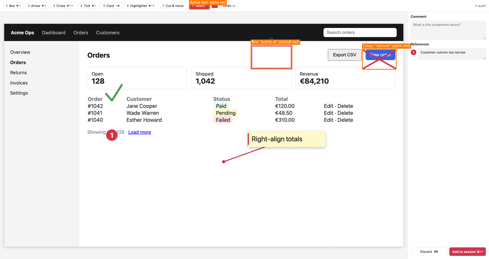

### 15. Cut an element and move it where it should go

**Scene:** reviewing an overnight build.

| #   | Pointer                                  | Keyboard                  | Today                                                      | Proposal                                                                      |
| --- | ---------------------------------------- | ------------------------- | ---------------------------------------------------------- | ----------------------------------------------------------------------------- |
| 1   | Click "7", drag around the Status column | 7, Enter, arrows, Enter   | Piece lifted; tool jumps to Select                         | Tool stays Cut & move                                                         |
| 2   | Drag the piece to the right of Total     | Arrows (Shift ×10), Enter | Dashed outline and arrow in red                            | In the move colour; labelled M1                                               |
| 3   | (optional) type a note for the move      | Tab to row M1, type       | Not possible                                               | "M1 Move: the Status column should sit right of Total"                        |
| 4   | Add                                      | ⌘↵                        | "Moved an element…"; also written if the piece never moved | "M1. Move: …", only if it moved; a redacted area in the piece stays pixelated |

### 16. Place a card that points at an element, then move the card

**Scene:** reviewing an overnight build.

| #   | Pointer                                                                        | Keyboard                                                                   | Today                                                  | Proposal                                                  |
| --- | ------------------------------------------------------------------------------ | -------------------------------------------------------------------------- | ------------------------------------------------------ | --------------------------------------------------------- |
| 1   | Shift+5 (or 5 twice today), press on "New order", drag to empty space, release | Shift+5, arrows to the target, Enter, arrows to where the card goes, Enter | Card with a pointer; the gesture is only in the README | The hint says how while Card is active                    |
| 2   | Type the text                                                                  | Type, Esc                                                                  | —                                                      | Card labelled "A"; row "Card A" in the panel              |
| 3   | Drag the card elsewhere                                                        | V, Tab to it, arrows                                                       | Needs V first                                          | Drag works from any tool with ⌘ held; the pointer follows |
| 4   | Fix a typo                                                                     | Double-click (any tool) / Enter                                            | Needs V, then double-click                             | —                                                         |
| 5   | Add                                                                            | ⌘↵                                                                         | "- Card: …", no letter, no target                      | "A (points at the New order button): …"                   |

### 17. Fix a mistake: undo, select, delete

**Scene:** reviewing an overnight build (the same in every scene).

| #   | Pointer                       | Keyboard       | Today                                 | Proposal                           |
| --- | ----------------------------- | -------------- | ------------------------------------- | ---------------------------------- |
| 1   | Draw a box in the wrong place | —              | —                                     | —                                  |
| 2   | Click Undo                    | ⌘Z             | Undone; nothing says what             | Tooltip "Undo box"                 |
| 3   | Select an arrow drawn earlier | V, Tab         | Click only                            | —                                  |
| 4   | Recolour it                   | Colour control | Stays red; only the next mark changes | Recoloured, undoable               |
| 5   | Nudge it                      | Arrows         | Nothing                               | Moves 1 px (Shift 10)              |
| 6   | Delete it                     | ⌫              | —                                     | Only when the screenshot has focus |
| 7   | Change your mind              | ⇧⌘Z            | Nothing                               | Redo                               |

### 18. First launch up to the first saved screenshot

**Scene:** a quick verdict (a teammate trying Snapmark for the first time).

| #   | Pointer                                                                 | Keyboard   | Today                                                             | Proposal                                                                                              |
| --- | ----------------------------------------------------------------------- | ---------- | ----------------------------------------------------------------- | ----------------------------------------------------------------------------------------------------- |
| 1   | Open the DMG, drag to Applications, open; System Settings › Open Anyway | —          | As the README says (unsigned, by the owner's choice)              | Same, with a picture in the README                                                                    |
| 2   | —                                                                       | —          | Nothing appears but a small icon                                  | Notification "Snapmark is in your menu bar. Press ⌘⇧1 to capture a region."                           |
| 3   | Click the icon                                                          | Ctrl+F8    | "Session: —", four items greyed                                   | "No session yet: press ⌘⇧1 to capture and start one"                                                  |
| 4   | Menu › Capture region                                                   | ⌘⇧1        | Without Screen Recording: an editor on the wallpaper, no word why | "Snapmark needs Screen Recording to see your apps. [Open System Settings]", then "[Restart Snapmark]" |
| 5   | Capture, mark a cross and a tick                                        | 3, …, 4, … | Session created silently                                          | "New session: 2026-09-25 09.14"                                                                       |
| 6   | Add                                                                     | ⌘↵         | Window vanishes                                                   | "Added 001 to 2026-09-25 09.14 · Open session.md"                                                     |

## Exceptions

Every exception in one place, with its reason and the screens it covers.

| Exception                                                          | Rule it departs from                                           | Reason                                                                                              | Screens                               |
| ------------------------------------------------------------------ | -------------------------------------------------------------- | --------------------------------------------------------------------------------------------------- | ------------------------------------- |
| Freehand Pen is pointer-only                                       | Every pointer action has a keyboard route                      | A path cannot be drawn with keys                                                                    | Editor canvas                         |
| An untouched screenshot closes without a question                  | One save per screenshot; Interrupt only to protect work        | Nothing to lose; a bad capture stays one key                                                        | Editor window                         |
| Redactions cannot be moved or resized                              | Edit a mark where it is                                        | Moving one would uncover what it hides                                                              | Editor canvas                         |
| Markers have a fixed size                                          | Edit a mark where it is                                        | Keeps a session even; size follows screen text instead                                              | Editor canvas                         |
| ⌘Z inside a text field is the field's own undo                     | One history per screenshot                                     | macOS convention while typing                                                                       | Comment, note fields, card text       |
| The capture overlay keeps macOS's keys                             | Keys act where the reviewer is; Interrupt only to protect work | It is macOS's own interface                                                                         | Capture overlay                       |
| The menu bar menu follows native menu keys                         | Select, edit and delete are separate                           | It is a native menu                                                                                 | Menu bar menu                         |
| Notifications and the folder dialog behave as macOS decides        | Behave like a macOS menu bar app                               | System surfaces                                                                                     | Notifications, sessions folder dialog |
| Background update checks stay silent                               | Confirm what leaves the editor                                 | Not started by the reviewer; only a found update is worth a word                                    | Updates                               |
| Entries saved before editable screenshots can only be removed      | A saved screenshot can be found and fixed                      | They were flattened                                                                                 | session.md                            |
| "Open Anyway" before the first launch stays                        | The first launch shows where Snapmark lives                    | The owner deferred signing: "defer delveoper-id to later. do the rest in the meantime" — 2026-09-25 | Install                               |
| Search and filters, media playback, connection to external systems | —                                                              | Not applicable (see each area)                                                                      | —                                     |

## Enforcement map

For each proposed rule: what would make breaking it impossible, whether that exists today, and what to
build. "Partly" means something exists but does not cover the rule; **not enforced** means nothing exists.
`ux:conformance` reads this table once rules are accepted.

| Rule                                                                                        | Enforced by                                                                                                                                                                                                                                                                                                                                               | Exists?                                                                                                                                                                                | To build                                                                                                                                                                                              |
| ------------------------------------------------------------------------------------------- | --------------------------------------------------------------------------------------------------------------------------------------------------------------------------------------------------------------------------------------------------------------------------------------------------------------------------------------------------------- | -------------------------------------------------------------------------------------------------------------------------------------------------------------------------------------- | ----------------------------------------------------------------------------------------------------------------------------------------------------------------------------------------------------- |
| Edit a mark where it is                                                                     | Canvas options set once in the editor (fixed on-screen handle size, 24 px hit area) plus an extension of `test/smoke.ts`: double-click a card with Box active edits it; Enter on a selected card edits; the colour control recolours the selection; → moves a mark 1 px; Esc mid-drag adds nothing; Cut & move stays active                               | No — **not enforced**                                                                                                                                                                  | Handle settings in the canvas setup; five smoke checks                                                                                                                                                |
| Red means remove, green means approve, and nothing else                                     | The tool table (`GROUPS` in `src/editor.ts`) as the only source of colours: Remove and Approve fixed, the pointing palette derived from it without red and green; smoke checks                                                                                                                                                                            | Partly: fixed colours for Remove and Approve exist in the tool table; `test/smoke.ts` checks "approve drawn green" but also asserts "marker drawn red", the opposite of this rule      | Neutral default and palette in the tool table; change the smoke check to "marker not red"; a check that no other code uses the red and green values; halo on line marks; black or white marker digits |
| Hiding and dimming sit under the marks                                                      | One layer-order helper that inserts redactions and spotlights directly above the screenshot, and cut pieces taken from the redacted image; smoke: redact, cut across it, move → piece pixelated; marker under a later redaction still visible; two spotlights both lit                                                                                    | No — **not enforced**                                                                                                                                                                  | The helper; three smoke checks                                                                                                                                                                        |
| The side panel is the text of the screenshot, linked to the marks                           | One entry model built from the canvas that feeds both the side-panel rows and the save payload, so they cannot disagree; smoke: a card appears as a row; selecting a marker highlights its row; buttons visible with 12 markers at 1180 × 600                                                                                                             | No — **not enforced**                                                                                                                                                                  | Entry model; three smoke checks                                                                                                                                                                       |
| Interrupt only to protect work; choose from menus                                           | One discard sheet in the main process, used by every exit, with Keep editing as default; smoke: Esc on the sheet keeps the editor                                                                                                                                                                                                                         | No — **not enforced**                                                                                                                                                                  | Sheet helper; folder dialog `message` and `buttonLabel`                                                                                                                                               |
| One save per screenshot, every way out is safe, and every state shows                       | One close guard in the main process (window `close` and app `before-quit`) that asks the page whether it has work; a save lock in the page; smoke: ⌘W with a mark does not close; ⌘W in a note does not close; ⌘↵ twice writes one entry; read-only folder → message shown and button enabled                                                             | No — **not enforced**                                                                                                                                                                  | Close guard, save lock, error area; four smoke checks                                                                                                                                                 |
| Undo what can be undone; say what cannot, before it happens                                 | Discard keeps the capture file until quit; menu item; smoke: after discard the file still exists and reopens                                                                                                                                                                                                                                              | No — **not enforced**                                                                                                                                                                  | Recent-discard file handling; "Reopen last screenshot" item; export and folder-change wording                                                                                                         |
| Confirm what leaves the editor, once; keep failures where they happened                     | One `notify(event, consequence, action)` helper for every message that refuses raw error text; one live region in the editor; a unit test mapping common errors (no space, missing folder, no permission) to sentences                                                                                                                                    | No — **not enforced**                                                                                                                                                                  | Helper, error map and its test; live region                                                                                                                                                           |
| Show progress on the control that started it                                                | One busy wrapper for save and exports that relabels the control and ignores repeats; smoke: second ⌘↵ while adding is ignored                                                                                                                                                                                                                             | No — **not enforced**                                                                                                                                                                  | Wrapper; menu item relabel for exports                                                                                                                                                                |
| The menu bar menu is home                                                                   | The menu built from one model, rebuilt each time it opens; a unit test of that model: every session reachable, order by last use, open editors listed, no session → next-step line                                                                                                                                                                        | No — **not enforced**                                                                                                                                                                  | Menu model and its test                                                                                                                                                                               |
| The editor names its session, keeps it, and links to it                                     | Window title set from the session and not overridden by the page; smoke: window title contains the session; label beside Add names it                                                                                                                                                                                                                     | No — **not enforced**                                                                                                                                                                  | Title fix; label menu; two smoke checks                                                                                                                                                               |
| A saved screenshot can be found and fixed                                                   | Marks saved as data next to each image; a round-trip test: save, reopen, save → one entry, same text                                                                                                                                                                                                                                                      | No — **not enforced**                                                                                                                                                                  | Mark data format; reopen path; test                                                                                                                                                                   |
| Select, edit and delete are separate, with a key for each                                   | Smoke: drag-select three marks and ⌫ removes three in one undo step; Backspace with focus on Discard deletes nothing; `test/sessions.test.ts` for list order                                                                                                                                                                                              | Partly: `test/sessions.test.ts` checks list order today, but it checks the reversed-name order this rule replaces                                                                      | Multi-select; last-use order and its test; two smoke checks                                                                                                                                           |
| Nothing is required; flag, never block; write the text as typed                             | Extension of `test/sessions.test.ts`: a multi-line note stays one numbered item; a comment starting with "#" is written literally; empty note wording; smoke: empty note row flagged                                                                                                                                                                      | Partly: `test/sessions.test.ts` checks note formatting and "_(no note)_", the wording this rule replaces                                                                               | Escaping and nesting in the writer; three test cases; persistent field labels                                                                                                                         |
| Fields, buttons and pressed tools can be seen and read                                      | A contrast test that computes ratios from the editor's colour tokens in light and dark (text 4.5:1, edges 3:1, pressed states, placeholders)                                                                                                                                                                                                              | No — **not enforced**                                                                                                                                                                  | Token contrast test; dark-appearance tokens for placeholders                                                                                                                                          |
| A tool key gives the same tool every time                                                   | The key handler reads behaviour from the tool table; smoke: fresh editor, 1 → Box; 5, click, 5, click → two markers; Shift+5 → Card                                                                                                                                                                                                                       | No — **not enforced** (`test/smoke.ts` currently relies on "1 again → ellipse" and "5 again → card")                                                                                   | New key behaviour; rewrite the smoke steps that depend on cycling                                                                                                                                     |
| Keys act where the reviewer is, and focus is never lost                                     | One keymap with a scope per key (screenshot, toolbar, field, anywhere); smoke: Space on a tool keeps focus on it; ⌘W in a field goes through the guard; a digit in a note stays in the note                                                                                                                                                               | No — **not enforced**                                                                                                                                                                  | Scoped keymap; toolbar updated in place instead of rebuilt; three smoke checks                                                                                                                        |
| Every pointer action has a keyboard route                                                   | Smoke: complete one screenshot (box, marker with note, card with pointer, cut & move) with key events only, no mouse events                                                                                                                                                                                                                               | No — **not enforced**                                                                                                                                                                  | Keyboard crosshair mode; two-click drawing; capture front window and screen; the keys-only smoke run                                                                                                  |
| Every control says what it is and what state it is in                                       | An accessibility-tree check in the smoke run: every button and field named, no unnamed text box, the screenshot named with its mark count, `lang` set                                                                                                                                                                                                     | No — **not enforced**                                                                                                                                                                  | Names and descriptions; the tree check                                                                                                                                                                |
| One history per screenshot, with Redo, that names its steps                                 | One history module with named, reversible steps; smoke: delete marker 1 then ⌘Z → still marker 1; ⇧⌘Z redoes; an empty card leaves no step; Undo disabled when empty                                                                                                                                                                                      | No — **not enforced**                                                                                                                                                                  | History module; four smoke checks                                                                                                                                                                     |
| Copy, cut, paste and duplicate marks; paste images; copy the session path                   | Smoke: ⌘C ⌘V → two marks; ⌘D on a marker → next number; a unit test for the "Copy path to session.md" text                                                                                                                                                                                                                                                | No — **not enforced**                                                                                                                                                                  | Mark clipboard; image paste; two menu items; checks                                                                                                                                                   |
| Drag on the canvas has an alternative; a file dropped from Finder never replaces the editor | Navigation blocked on every editor window in the main process; smoke: a synthetic drop does not navigate                                                                                                                                                                                                                                                  | No — **not enforced**                                                                                                                                                                  | `will-navigate` guard; drop handling; check                                                                                                                                                           |
| Behave like a macOS menu bar app                                                            | Snapmark's own application menu set once at start; a test that it has no reload or developer-tools role and has Undo, Redo, Copy, Paste, Duplicate, Close and Quit                                                                                                                                                                                        | No — **not enforced**                                                                                                                                                                  | Application menu; context menus; Shortcuts… window; test                                                                                                                                              |
| The editor fits the window and can be zoomed                                                | Minimum size on the editor window; smoke at 1180 × 600 and 200% zoom: every toolbar control inside the window                                                                                                                                                                                                                                             | No — **not enforced**                                                                                                                                                                  | `minWidth`/`minHeight`; compact toolbar; zoom and pan; check                                                                                                                                          |
| A write either happens completely or not at all, and says what it replaces                  | The session writer returns a result and writes the image and text as one step; `test/sessions.test.ts`: a failed append leaves no image; `test/exporter.test.ts` for export naming                                                                                                                                                                        | Partly: `test/sessions.test.ts` checks numbering survives deleted images; `test/exporter.test.ts` checks re-export replaces and never nests                                            | All-or-nothing write; existence checks before open and save; failure tests                                                                                                                            |
| The text says what the image shows                                                          | One mark vocabulary, taken from the tool table, that generates the toolbar labels, the prompt key, the session.md key line and each entry's mark summary; `test/sessions.test.ts` and smoke: session.md names remove and approve marks, has the key line, labels cards and moves; `test/exporter.test.ts`: PDF page has a title, `lang` and real alt text | Partly: `test/smoke.ts` checks the card, move, numbered notes, caption and prompt path appear; `test/exporter.test.ts` checks the alt text is "Screenshot 1", which this rule replaces | Generated key and summaries; writer changes; tagged PDF; new assertions                                                                                                                               |
| Remember where work goes, not how the last screenshot was drawn                             | One settings store with a fixed shape; a unit test of what is saved and restored                                                                                                                                                                                                                                                                          | Partly: `state.json` keeps the active session and folder; no test                                                                                                                      | Store fields (colour, last use, shortcuts, first-run flag); test                                                                                                                                      |
| The first launch shows where Snapmark lives and gets the first capture right                | A first-run flag in the settings store; a permission check before every capture                                                                                                                                                                                                                                                                           | No — **not enforced**                                                                                                                                                                  | Flag, notification, permission guide; update item wording until signing                                                                                                                               |
| Help lives in the app and is always true                                                    | One key table that generates the toolbar tooltips, the "?" list and the README key section; a test that the README table matches it; the hint derived from the active tool                                                                                                                                                                                | No — **not enforced**                                                                                                                                                                  | Key table; "?" list; README check                                                                                                                                                                     |
| One name for each thing, everywhere                                                         | One strings file keyed by glossary term; a test that fails on retired words ("References", "Numbered", "keep this", "entry", "Remove area") in the interface, prompt, session.md writer and README                                                                                                                                                        | No — **not enforced**                                                                                                                                                                  | Strings file; banned-words test                                                                                                                                                                       |
| Motion only explains a change, briefly, and never with Reduce Motion on                     | A lint check that every CSS transition or animation sits inside a reduced-motion query                                                                                                                                                                                                                                                                    | No — **not enforced**                                                                                                                                                                  | The check (nothing animates today)                                                                                                                                                                    |
